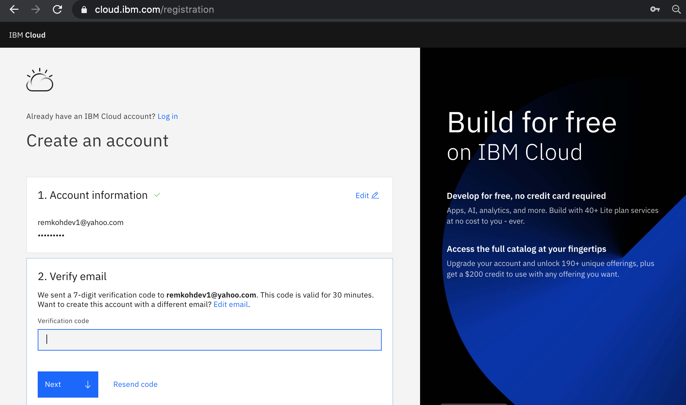
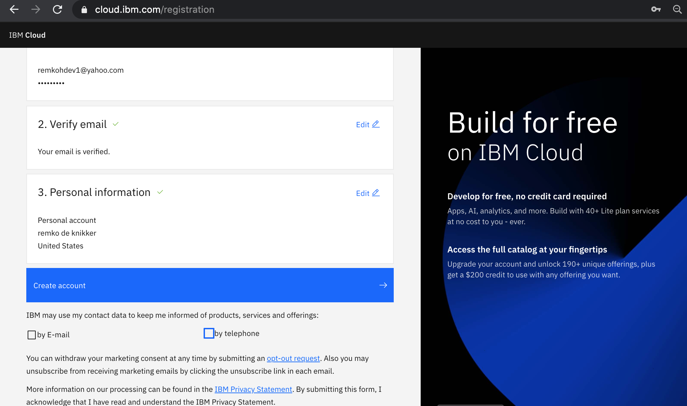
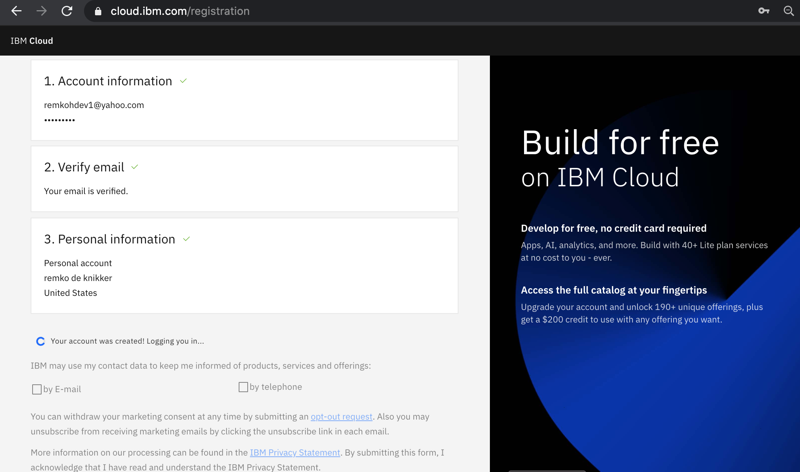
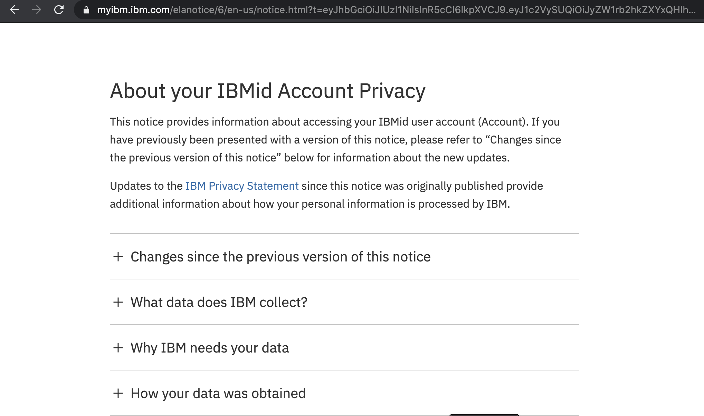
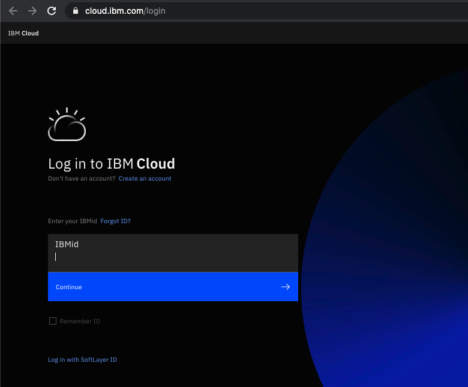
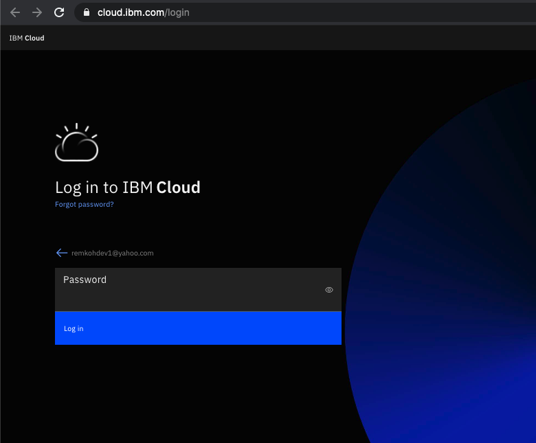

# IBM Cloud - Create a New Account

To create a new account, follow the steps below,

1. You need an IBM Cloud account to access your cluster,
1. If you do not have an IBM Cloud account yet, go to <https://cloud.ibm.com/registration> to register,
1. In the `Create an account` window, enter your email and password,

    

1. The `Verify email` section will inform you that a verification code was sent to your email,

    

1. Switch to your email provider to retrieve the verification code,

    

1. Enter the verification code in the `Verify email` section, and click `Next`,

    

1. Enter your first name, last name and country in the `Personal information` section and click `Next`,

    

1. Click `Create account`,

    

1. Your account is being created,

    

1. Review the `IBM Privacy Statement`,

    

1. Click `Proceed` to acknowledge the privacy statement,

    

1. Switch to your email provider to review the `Welcome to IBM Cloud` email, and click the `Login` link,

    

1. Enter your IBM Id to login,

    

1. Enter your password to login,

    

1. The IBM Cloud dashboard page should load,

    

1. You have successfully registered a new IBM Cloud account.
