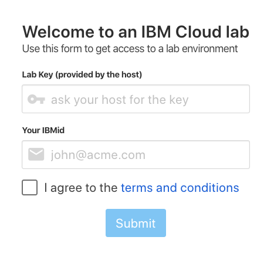
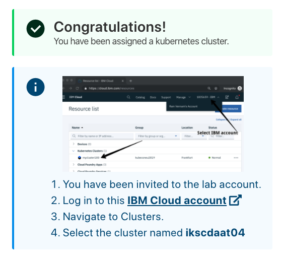
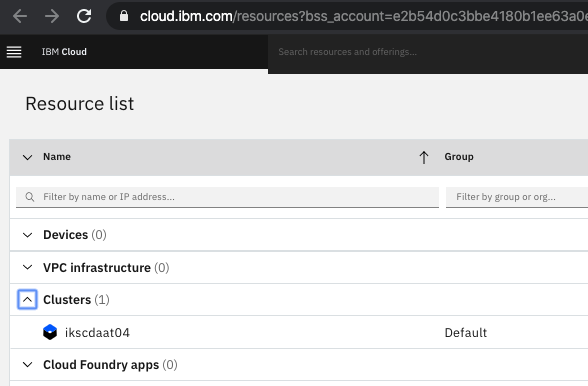
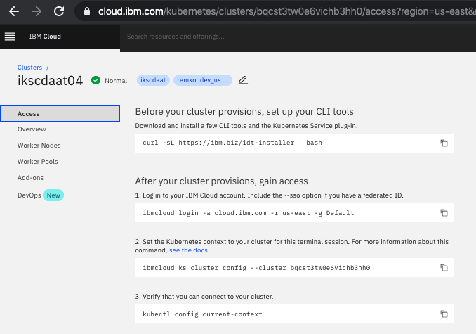

# Setup

## IBM Kubernetes Service (IKS) and OpenShift

For the hands-on labs included in the conference, you can use a free cluster that was created for you to use for the workshop. The cluster will deleted after the conference again. 

1. You need an IBM Cloud account to access your cluster,
1. If you do not have an IBM Cloud account yet, register at https://cloud.ibm.com/registration, 
1. Or find instructions to create a new IBM Cloud account [here](NEWACCOUNT.md),
1. Open the URL that was provided to you to access your cluster,

	

1. Log in to this IBM Cloud account using the workshop code and your IBM Cloud account IBM id,
1. Instructions will ask to `Log in to this IBM Cloud account`

	

1. Navigate to Clusters,
1. And select the cluster assigned to you... 

	

1. Details for your cluster will load,
1. Go to the `Access` menu item in the left navigation column,
1. Follow the instructions to access your cluster from the client,

	

1. We recommend to use the IBM Cloud Shell at https://shell.cloud.ibm.com/. It is attached to your IBMid. It might take a few moments to create the instance and a new session,

	

1. You should now be read to start with [Lab 1](../lab-01/README.md) or go back to the [Summary](../SUMMARY.md).
