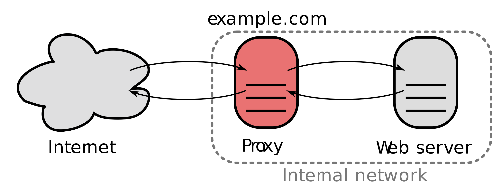
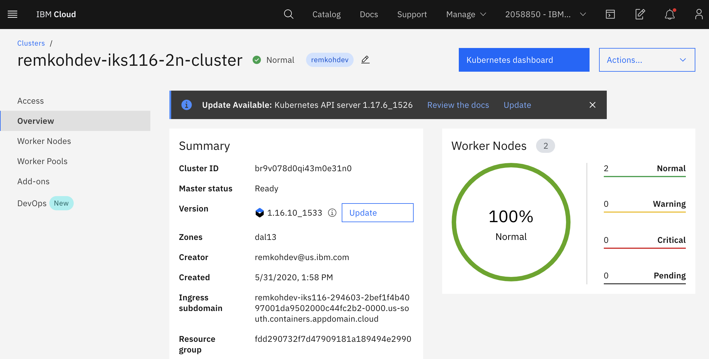

# Lab 01 - Kubernetes Networking, using Service Types, Ingress and Network Policies to Control Application Access

Self: https://github.com/remkohdev/kubernetes-networking

In this lab we will use several methods to control access to applications on a Kubernetes cluster. We will go through Kubernetes Networking principles and apply different types of Service resources: ClusterIP, NodePort and LoadBalancer. We will also implement an Ingress resource and a Network Policy, while we briefly will talk about Calico policies as well.

You need an IBM account to follow the lab. See the [Account Setup and Cluster Access](../lab-00/README.md)

In the first steps, you access your cluster, deploy a MongoDB instance and a HelloWorld application, which will take about 15 minutes.

During the remainder of the lab, you will create different Service types, an Ingress and a Network Policy.

## 00. Access Your Cluster

Follow the instructions at [Account Setup and Cluster Access](../lab-00/README.md) to claim a pre-created cluster. Go to the `Access` page to find the login instructions.

Access your `Cloud Shell` at https://shell.cloud.ibm.com and login to your remote cluster.

Set a CLUSTERNAME environment variable to the name of your cluster.

```
$ export CLUSTERNAME=remkohdev-iks116-2n-cluster-labs
```

Login and download the cluster configuration,

```
$ ibmcloud login 
$ ibmcloud ks cluster config --cluster $CLUSTERNAME
```

## 01. Setup MongoDB

We will begin by deploying a MongoDB database and a HelloWorld application that stores messages into the MongoDB.

I will use Helm to deploy and configure a Bitnami/MongoDB chart. Go to [Deploy MongoDB](MONGODB.md) to setup MongoDB for our HelloWorld app.


## 02. Deploy a HelloWorld App

Now, you have a MongoDB installed, follow the instructions to [Deploy a HelloWorld App with ClusterIP](JAVAAPP.md).


## Services

Now we can start with the actual lab on Kubernetes Networking. 

When we created the Java Spring Boot App called `HelloWorld`, we created a Deployment. The deployment created also a ReplicaSet with 1 replica of the pods. Because we did not create a Service for the `helloworld` containers running in pods, they cannot yet be accessed. 

When a Pod is deployed to a worker node, it is assigned a `private IP address` in the 172.30.0.0/16 range. Worker nodes and pods can securely communicate on the private network by using private IP addresses. 

However, because Kubernetes creates and destroys Pods dynamically, the location of the Pods, and thus the private IP addresses, change. 

With a `Service` object, you can use built-in Kubernetes `service discovery` to expose Pods. A Service defines a set of Pods and a policy to access those Pods. Kubernetes assigns a single DNS name for a set of Pods and can load balance requests across Pods. When you create a Service, a set of pods and `EndPoints` are created to manage access to the pods.

The Endpoints object in Kubernetes is the list of IP and port addresses to the Pods and are created automatically when a Service is created and are configured with the pods matching the selector defined in the Service. A Service can be configured without a selector, in that case Kubernetes does not create an associated Endpoints object.

Let's look at the declaration of the `service.yaml`,

```
$ cat service.yaml

apiVersion: v1
kind: Service
metadata:
  name: helloworld
  labels:
    app: helloworld
spec:
  ports:
  - port: 8080
    targetPort: http-server
  selector:
    app: helloworld
```

The `spec` defines a few important attributes, especially `selector` and `ports`. The set of Pods that a Service targets, is determined by the selector using labels. When a Service has no selector, the corresponding `Endpoints` object is not created automatically. This can be useful in cases where you want to define an Endpoint manually, for instance in the case of an external database instance.

The Service maps the incoming `port` to a `targetPort` of the Deployment. By default the `targetPort` is set to the same value as the incoming `port` field. A port definition in Pods can also be given a name, and you can reference these names in the `targetPort` attribute of the Service instead of using a port number. In the Service example of `helloworld`, the `deployment.yaml` file should then have the corresponding port defined that the Service references by name,

```
$ cat deployment.yaml

ports:
- name: http-server
  containerPort: 8080
```

## ServiceTypes

Before you create a Service for the `helloworld` application, let's first understand what types of services exist. Kubernetes `ServiceTypes` allow you to specify what kind of Service you want. 

The default type is `ClusterIP`. To expose a Service onto an external IP address, you have to create a ServiceType other than ClusterIP.

ServiceType values and their behaviors are:

- **ClusterIP**: Exposes the Service on a cluster-internal IP. This is the default ServiceType.
- **NodePort**: Exposes the Service on each Node’s IP at a static port (the NodePort). A ClusterIP Service, to which the NodePort Service routes, is also automatically created. You’ll be able to contact the NodePort Service, from outside the cluster, by requesting <Node-Public-IP>:<NodePort>.
- **LoadBalancer**: Exposes the Service externally using a cloud provider’s load balancer. The NodePort and ClusterIP Services, to which the external load balancer routes, are also automatically created.
- **ExternalName**: Maps the Service to the contents of the externalName field (e.g. foo.bar.example.com), by returning a CNAME record.

An [ExternalName Service](https://kubernetes.io/docs/concepts/services-networking/service/#externalname) is a special case of Service that does not have selectors and uses DNS names instead, e.g. 

```
apiVersion: v1
kind: Service
metadata:
  name: my-database-svc
  namespace: prod
spec:
  type: ExternalName
  externalName: my.database.example.com
```

In this example, when you request the service `my-database-svc.prod.svc.cluster.local` on the cluster, the cluster DNS Service returns a CNAME record for `my.database.example.com`.


You can also use `Ingress` in place of `Service` to expose HTTP/HTTPS Services. Ingress however is technically not a ServiceType, but it acts as the entry point for your cluster and lets you consolidate routing rules into a single resource.


## 03. ClusterIP

### Add a Service to `helloworld`


Now you have a simple understanding of the different ServiceTypes on Kubernetes, it is time to expose the Deployment of `helloworld` using a Service. 

Create the Service object with the default type, you already created the Service resource file when you deployed the HelloWorld app in the previous step.

```
$ kubectl create -f service.yaml
service/helloworld created
```

Describe the Service,

```
$ kubectl describe svc helloworld
Name:              helloworld
Namespace:         default
Labels:            app=helloworld
Annotations:       <none>
Selector:          app=helloworld
Type:              ClusterIP
IP:                172.21.161.255
Port:              <unset>  8080/TCP
TargetPort:        http-server/TCP
Endpoints:         172.30.153.79:8080
Session Affinity:  None
Events:            <none>
```

You see that Kubernetes by default creates a Service of type `ClusterIP`. The service is now available and discoverable, but only within the cluster.

Get the endpoints that were created as part of the Service,

```
$ kubectl get endpoints helloworld
NAME         ENDPOINTS                                                  AGE
helloworld   172.30.153.79:8080   43s
```

To review the full endpoints resource, use the `kubectl edit` command, but don't make any changes.
```
$ kubectl edit endpoints helloworld

apiVersion: v1
kind: Endpoints
metadata:
  name: helloworld
  namespace: default
  labels:
    app: helloworld
subsets:
  - addresses:
      - ip: 172.30.153.79
        targetRef:
          kind: Pod
          name: helloworld-5f8b6b587b-lwvcs 
```

Enter `<ESC>` + `:q` to exit the commandline vim editor.

The Endpoints object now maps the Service object to the Pod on an internal IP address, so that other pods can access the Service of our HelloWorld application.


## 04. NodePort

The HelloWorld Service is accessible now but only within the cluster. To expose a Service onto an external IP address, you have to create a ServiceType other than ClusterIP. Apps inside the cluster can access a pod by using the in-cluster IP of the service or by sending a request to the name of the service. When you use the name of the service, `kube-proxy` looks up the name in the cluster DNS provider and routes the request to the in-cluster IP address of the service. 

To allow external traffic into a kubernetes cluster, you need a `NodePort` ServiceType. If you set the `type` field of Service to `NodePort`, Kubernetes allocates a port in the range 30000-32767. Each node proxies the assigned NodePort (the same port number on every Node) into your Service. 

Patch the existing Service for `helloworld` to `type: NodePort`,

```
$ kubectl patch svc helloworld -p '{"spec": {"type": "NodePort"}}'
service/helloworld patched
```

Describe the Service again,

```
$ kubectl describe svc helloworld

Name:                     helloworld
Namespace:                default
Labels:                   app=helloworld
Annotations:              <none>
Selector:                 app=helloworld
Type:                     NodePort
IP:                       172.21.161.255
Port:                     <unset>  8080/TCP
TargetPort:               http-server/TCP
NodePort:                 <unset>  31777/TCP
Endpoints:                172.30.153.79:8080
Session Affinity:         None
External Traffic Policy:  Cluster
Events:                   <none>
```

In this example, Kubernetes added a NodePort with port value 31777 in this example. For everyone, this is likely to be a different port in the range 30000-32767.

You can now connect to the service via the public IP address of any worker node in the cluster and traffic gets forwarded to the service, which uses service discovery and the selector of the Service to deliver the request to the assigned pod. With this piece in place we now have a complete pipeline for load balancing external client requests to all the nodes in the cluster.

You don't have sufficient permissions to retrieve the cluster's worker nodes' Public IPs for the account that the clusters were created on, via the cloud shell and the `ibmcloud` cli. But you can find the worker nodes of your cluster in the cluster detail page in the IBM Cloud UI. Find your cluster via https://cloud.ibm.com/kubernetes/clusters. Select your cluster and go to `Worker Nodes`, look for the Public IP of one of the worker nodes.


If you do have sufficient permissions you can view the worker nodes of your cluster with the command,

```
$ ibmcloud ks worker ls --cluster $CLUSTERNAME
```

Test the deployment, e.g. with the example values for PUBLICIP and NODEPORT, again be aware that the PUBLIC_IP and NODEPORT are different for each of you.

```
$ PUBLICIP=150.238.93.100
$ NODEPORT=31110
$ curl "http://$PUBLICIP:$NODEPORT/api"
Welcome to Spring Boot App

$ curl "http://$PUBLICIP:$NODEPORT/api/hello?name=John"
{ "message" : "Hello John" }

$ curl "http://$PUBLICIP:$NODEPORT/api/messages"
[{"id":"5edda3befc271d2b0330b8a6","sender":"John","message":"Hello John"}]
```

The client connects to the load balancer via a public IP address on the worker node. The load balancer selects a node and connects to it. Kube-proxy receives this connection and forwards it to the service at the cluster IP. At this point the request matches the netfilter rules and gets redirected to the server pod.


# 05. Loadbalancer

In the previous steps, you created a service for the `helloworld` application with a clusterIP and then added a NodePort to the Service. But you still want a load balancer of some kind in front of your application, whether your clients are internal or coming in over the public network. A load balancer acts as a reverse proxy and distributes network or application traffic across a number of servers.



To use a load balancer as a reverse proxy for distributing client traffic to the nodes in a cluster, you need a public IP address for the service that the clients can connect to, and you need IP addresses on the nodes themselves to which the load balancer can forward the requests.

A service of type `LoadBalancer` has all the capabilities of a `NodePort` service but also the ability to build out a complete ingress path. A `LoadBalancer` also has some limitations: you cannot configure the load balancer to terminate https traffic, do virtual hosts or path-based routing, so you can’t use a single load balancer to proxy to multiple services. These limitations led to the addition of a separate kubernetes resource for configuring load balancers, called an `Ingress` (see next section). 

On cloud providers that support external load balancers, setting the `type` field to `LoadBalancer` provisions a load balancer for your Service. The actual creation of the load balancer happens asynchronously with the Service, so you might have to wait until the load balancer has been created.

### Load Balancer on IKS

The LoadBalancer service type is implemented differently depending on your cluster's infrastructure provider. On IKS (IBM Kubernetes Service), a `classic cluster` implements a Network Load Balancer (NLB) 1.0 by default. 

### Load Balancing Methods

Before we create the load balancer with `NLB v1.0 + subdomain` for the `helloworld` application, review the different Load Balancing Methods on IKS:

- `NodePort` exposes the app via a port and public IP address on a worker node.
- `NLB v1.0 + subdomain` uses basic load balancing that exposes the app with an IP address or a subdomain.
- `NLB v2.0 + subdomain`, uses Direct Server Return (DSR) load balancing, which does not change the packets but the destination address, and exposes the app with an IP address or a subdomain, supports SSL termination. (Network load balancer (NLB) 2.0 is in beta.)
- `Istio + NLB subdomain` uses basic load balancing that exposes the app with a subdomain and uses Istio routing rules.
- `Ingress with public ALB` (Application Load Balancing) uses HTTPS load balancing that exposes the app with a subdomain and uses custom routing rules and SSL termination for multiple apps. You can customize the ALB routing rules with [annotations](https://cloud.ibm.com/docs/containers?topic=containers-ingress_annotation) (See next section).
- `Custom Ingress + NLB subdomain` uses HTTPS load balancing with a custom Ingress that exposes the app with the IBM-provided ALB subdomain and uses custom routing rules.

### Create a Network Load Balancer v1.0

In the previous lab, you already created a `NodePort` Service. Patch the service for `helloworld` and change the type to `LoadBalancer`.

```
$ kubectl patch svc helloworld -p '{"spec": {"type": "LoadBalancer"}}'
service/helloworld patched
```

If your cluster has more than 1 worker node, a LoadBalancer will be created and an external IP address is assigned to access the service. 

```
$ kubectl get svc helloworld
NAME    TYPE    CLUSTER-IP    EXTERNAL-IP    PORT(S)    AGE
helloworld   LoadBalancer   172.21.161.255   169.48.67.163   8080:31777/TCP   24m
```

The biggest difference you can see is the presence of an External IP address for the service now.

Or describe the `helloworld` Service,

```
$ kubectl describe svc helloworld
```

A Service of type LoadBalancer was created, 1 of 4 available portable public IP addresses were assigned to the Service. When you create a standard cluster on IBM Cloud, IKS automatically provisions a portable public subnet and a portable private subnet. 

Now to access the NLB for the Service of the `helloworld` from the internet, you can use the public IP address of the NLB and the assigned port of the service in the format `<External_IP_Address>:<NodePort>`. NodePorts are accessible on every public and private IP address of every worker node within the cluster.

Access the `helloworld` app in a browser or with Curl,
```
$ EXTERNALIP=169.48.67.163
$ curl "http://$EXTERNALIP:$NODEPORT/api/hello?name=MeAgain" 
{ "message" : "Hello MeAgain" }

$ curl "http://$EXTERNALIP:$NODEPORT/api/messages"
[{"id":"5ee6e6206e986548955388ee","sender":"John","message":"Hello John"},{"id":"5ee6e72e6e986548955388ef","sender":"MeAgain","
message":"Hello MeAgain"}]
```

## 06. Ingress

`Ingress` is technically not a Service, but a load balancer and router for container clusters. It is a Kubernetes API object that manages external access to the services in a cluster. You can use `Ingress` to expose multiple app services to a public or private network by using a unique public or private route. The Ingress API also supports TLS termination, virtual hosts, and path-based routing.

When you create a standard cluster, an Ingress subdomain is already registered by default for your cluster, see the previous step. The paths to your app services are appended to this public route of the default Ingress Subdomain.

In a standard cluster on IKS, the Ingress `Application Load Balancer (ALB)` implements the `NGINX` Ingress controller. NGINX is one of the more popular load balancers and reverse proxies.

To expose an app using Ingress, you must define an `Ingress` resource first. The Ingress resource is a Kubernetes resource that defines the rules for how to route incoming requests for apps. 

One Ingress resource is required per namespace where you have apps that you want to expose.


## Changes to HelloWorld for Ingress

I want to access `HelloWorld` via the Ingress subdomain and a path rule via a path `/hello`.

You need the Ingress Subdomain and Ingress Secret of your cluster to configure your Ingress resource. Go to your cluster's Overview page to see the Ingress subdomain and secret.



The `Ingress Secret` will be the first part of the 
`Ingress Subdomain` of your cluster. E.g. if the `Ingress Subdomain` is the following:
```
remkohdev-iks116-294603-2bef1f4b4097001da9502000c44fc2b2-0000.us-south.containers.appdomain.cloud
```
Then the `Ingress Secret` will be,
```
remkohdev-iks116-294603-2bef1f4b4097001da9502000c44fc2b2-0000
```

The `Ingress Subdomain` has a format like `clustername-<hash>.region.containers.appdomain.cloud`.

If you have account management permissions, you can use the `ibmcloud` command in the CLI to retrieve the Ingress Subdomain and Secret,

```
$ ibmcloud ks nlb-dns ls --cluster $CLUSTERNAME
OK
Hostname    IP(s)    Health Monitor    SSL Cert Status    SSL Cert Secret Name    Secret Namespace
remkohdev-iks116-294603-2bef1f4b4097001da9502000c44fc2b2-0000.us-south.containers.appdomain.cloud    169.48.67.162    None    created    remkohdev-iks116-294603-2bef1f4b4097001da9502000c44fc2b2-0000    default 
```

Or,

```
$ ibmcloud ks cluster get --show-resources -c $CLUSTERNAME
```

Once you have the Ingress Subdomain and the Ingress Secret, create an Ingress resource with the following command, using a `rewrite path` annotation. 

In the file below, make sure to change the `hosts` and `host` to the `Ingress Subdomain` of your cluster, and change the `secretName` to the value `Ingress Secret` of your cluster. 

```
$ echo 'apiVersion: extensions/v1beta1
kind: Ingress
metadata:
  name: helloworld-ingress
  annotations:
    ingress.bluemix.net/rewrite-path: serviceName=helloworld rewrite=/
spec:
  tls:
  - hosts:
    - <Ingress Subdomain>
    secretName: <Ingress Secret>
  rules:
  - host: <Ingress Subdomain>
    http:
      paths:
      - path: /hello
        backend:
          serviceName: helloworld
          servicePort: 8080' > ingress.yaml
```

Make sure you changed the values for `hosts`, `secretName` and `host`, edit the `ingress.yaml` file to make the necessary changes,

```
$ vi ingress.yaml
```

Then create the Ingress for helloworld,

```
$ kubectl create -f ingress.yaml
ingress.extensions/helloworld-ingress created
```

The above resource will create a similar access path to helloworld as `https://remkohdev-iks116-2n-clu-2bef1f4b4097001da9502000c44fc2b2-0000.us-south.containers.appdomain.cloud/hello`. 

You can further [customize Ingres routing with annotations](https://cloud.ibm.com/docs/containers?topic=containers-ingress_annotation) to customize the ALB settings, TLS settings, request and response annocations, service limits, user authentication, or error actions etc.. 

Try to access the `helloworld` API and the proxy using the Ingress Subdomain with the path to the service,

```
$ HOST=remkohdev-iks116-294603-2bef1f4b4097001da9502000c44fc2b2-0000.us-south.containers.appdomain.cloud

$ curl "http://$HOST/hello/api/hello?name=JaneDoe" 
{ "message" : "Hello JaneDoe" }

$ curl "http://$HOST/hello/api/messages"
[{"id":"5ee27306040cd720fa7ba32d","sender":"John","message":"Hello John"},{"id":"5ee274e7040cd720fa7ba32e","sender":"MeAgain","message":"Hello MeAgain"},{"id":"5ee2f325040cd720fa7ba32f","sender":"JaneDoe","message":"Hello JaneDoe"}]
```

If you instead want to use subdomain paths instead of URI paths, you would add the subdomain prefix to the hosts attribute. We skip creating subdomain paths, but review the followig example. 
```
apiVersion: extensions/v1beta1
kind: Ingress
metadata:
  name: helloworld-ingress
spec:
  tls:
  - hosts:
    - remkohdev-iks116-3x-clu-2bef1f4b4097001da9502000c44fc2b2-0000.us-south.containers.appdomain.cloud
    secretName: remkohdev-iks116-3x-clu-2bef1f4b4097001da9502000c44fc2b2-0000
  rules:
    - host: >-
        hello.remkohdev-iks116-2n-clu-2bef1f4b4097001da9502000c44fc2b2-0000.us-south.containers.appdomain.cloud
      http:
        paths:
          - backend:
              serviceName: helloworld
              servicePort: 8080
    - host: >-
        helloproxy.remkohdev-iks116-2n-clu-2bef1f4b4097001da9502000c44fc2b2-0000.us-south.containers.appdomain.cloud
      http:
        paths:
          - backend:
              serviceName: helloworld-proxy
              servicePort: 8080
```

This Ingress resource will create an access path to app1 at https://hello.remkohdev-iks116-2n-clu-2bef1f4b4097001da9502000c44fc2b2-0000.us-south.containers.appdomain.cloud/


## 07. Network Policy

In this last section of the Kubernetes Networking lab, I want to create a Network Policy that only allows traffic coming from the HelloWorld application in the `default` namespace and not from another HelloWorld application in a `test` namespace.

So first, create a new instance of the HelloWorld application in a new namespace called `test`.

Create a new namespace `test`,

```
$ kubectl create namespace test
```

Create a second deployment of HelloWorld in the `test` namespace connecting to the same MongoDB service in the `default` namespace. Create the Kubernetes deployment resource,

```
$ echo 'apiVersion: apps/v1
kind: Deployment
metadata:
  name: helloworld2
  namespace: test
  labels:
    app: helloworld2
spec:
  replicas: 1
  selector:
    matchLabels:
      app: helloworld2
  template:
    metadata:
      labels:
        app: helloworld2
    spec:
      containers:
      - name: helloworld2
        image: remkohdev/helloworld:lab1v1.0
        ports:
        - name: http-server
          containerPort: 8080' > deployment2.yaml
```

Create the kubernetes Service resource in the `test` namespace,

```
$ echo 'apiVersion: v1
kind: Service
metadata:
  name: helloworld2
  namespace: test
  labels:
    app: helloworld2
spec:
  type: LoadBalancer
  ports:
  - port: 8080
    targetPort: http-server
  selector:
    app: helloworld2
' > service2.yaml
```

Deploy the Kubernetes Deployment and Service resource for HellWorld2 in the `test` namespace using the shared MongoDB instance in the `default` namespace,

```
$ kubectl create -f deployment2.yaml
$ kubectl create -f service2.yaml
```

Get the External IP and the NodePort for the new service,

```
$ kubectl get svc helloworld2 -n test
NAME          TYPE           CLUSTER-IP      EXTERNAL-IP    PORT(S)          AGE
helloworld2   LoadBalancer   172.21.176.80   169.48.215.4   8080:31429/TCP   34s
```

Test the connection to the MongoDB instance,

    ```
    $ EXTERNALIP2=169.48.215.4
    $ NODEPORT2=31429

    $ curl http://$EXTERNALIP2:$NODEPORT2/api/messages
    [{"id":"5edda3befc271d2b0330b8a6","sender":"john","message":"Hello john"},{"id":"5edda81e9a848c335b5d1e40","sender":"john","message":"Hello john"},{"id":"5eddac2e9a848c335b5d1e41","sender":"MeAgain","message":"Hello MeAgain"},{"id":"5eddb2269a848c335b5d1e42","sender":"JaneDoe","message":"Hello JaneDoe"}]
    ```

Get a new message,

```
$ curl http://$EXTERNALIP2:$NODEPORT2/api/hello?name=Joe2
{ "message" : "Hello Joe2" }
```

### Network Policy

A network policy is a specification of how pods are allowed to communicate with each other and other network endpoints. By default pods are allowed to communicate with all pods, they are `non-isolated`. But there are conditions where you want pods to reject traffic.

NetworkPolicy uses labels to select pods and define rules which specify what traffic is allowed. A `policyTypes` field in the NetworkPolicy specification includes either `Ingress`, `Egress`, or both. `Ingress` means `coming in`, and `egress` means `going out`. Each rule in ingress/egress allows traffic which matches both the from/to and ports sections. 

There are four kinds of selectors that group pods in an ingress `from` section or egress `to` section:
- podSelector,
- namespaceSelector,
- podSelector and namespaceSelector,
- ipBlock for IP CIDR ranges.

By grouping pods by pod name, namespace, or IP, you can allow and reject incoming and outgoing traffic on a cluster. When you create a Kubernetes cluster on IBM Cloud, default network policies are set up to secure the public network interface of every worker node in the cluster. 

Every IBM Cloud Kubernetes Service (IKS) cluster is set up with a network plug-in called `Calico`. You can use both Kubernetes and Calico to create network policies for a cluster. 

[Project Calico](https://docs.projectcalico.org/introduction/) is an open source networking and network security project for containers, Kubernetes, OpenShift but also Istio among other. Some of the advantages are that it can enforce a policy at different layers, at the host networking layer or at the service mesh layer for instance; it uses Linux kernel's optimized forwarding and access control capabilities; Calico is interoperable between Kubernetes and non-Kubernetes, in public cloud, on-prem on VMs or bare metal servers; Calico supports the Kubernetes API as well as extended network policy capabilities; and of course at IBM we love Calico because we love open source! ;-)

When a Kubernetes network policy is applied, it is automatically converted into a Calico network policy so that Calico can apply it as an Iptables rule. Calico network policies are a superset of the Kubernetes network policies and are applied by using calicoctl commands. Calico enforces the policies.

Calico uses two policy resources: NetworkPolicy and GlobalNetworkPolicy resources. A network policy is a namespaced resource that applies to pods/containers/VMs in that namespace.

```
apiVersion: projectcalico.org/v3
kind: NetworkPolicy
```

Calico global network policy is a non-namespaced resource and can be applied to any kind of endpoint (pods, VMs, host interfaces) independent of namespace.

```
apiVersion: projectcalico.org/v3
kind: GlobalNetworkPolicy
```

To create Calico NetworkPolicy or GlobalNetworkPolicy resources, you must install the calicoctl CLI. That takes a little bit too much time for this lab, so no Calico labs will be included in this hands-on lab. 


To block all traffic from and to the `test` namespace, create the following Network Policy,

```
$ echo 'kind: NetworkPolicy
apiVersion: networking.k8s.io/v1
metadata:
    name: test-deny
    namespace: test
spec:
  podSelector:
    matchLabels: {}
  policyTypes:
  - Ingress
  - Egress' > deny-test-namespace.yaml
```

Then create the Kubernetes Network Policy,

```
$ kubectl create -f deny-test-namespace.yaml
networkpolicy.networking.k8s.io/test-deny created
```

Remember that when a Kubernetes network policy is created, it is automatically converted into a Calico network policy.

Try to access the HelloWorld2 API in the test namespace, via the LoadBalancer Service details for External IP and NodePort,

```
$ kubectl get svc helloworld2 -n test
$ curl http://$EXTERNALIP2:$NODEPORT2/api/messages
curl: (7) Failed to connect to 169.48.67.164 port 32401: Connection timed out
```

The service in the `test` namespace fails because it tries to access the MongoDB instance in the `default` namespace, but that is not allowed.

Now, try to access the HelloWorld API in the default namespace, by using the `helloworld` service details in the `default` namespace.

```
$ kubectl get svc helloworld
$ curl http://$EXTERNALIP:$NODEPORT/api/messages
[{"id":"5edda3befc271d2b0330b8a6","sender":"john","message":"Hello john"},{"id":"5edda81e9a848c335b5d1e40","
sender":"john","message":"Hello john"},{"id":"5eddac2e9a848c335b5d1e41","sender":"MeAgain","message":"Hello 
MeAgain"},{"id":"5eddb2269a848c335b5d1e42","sender":"JaneDoe","message":"Hello JaneDoe"},{"id":"5edeee2a2e61
fc739ece0820","sender":"Joe2","message":"Hello Joe2"}]
```

Delete the `test-deny` Network Policy again, 

```
$ kubectl delete NetworkPolicy test-deny -n test
```

Now your traffic from helloworld2 to the default namespace is allowed again.

```
$ curl http://$EXTERNALIP2:$NODEPORT2/api/messages
[{"id":"5ee6e6206e986548955388ee","sender":"John","message":"Hello John"},{"id":"5ee6e72e6e986548955388ef","sender":"MeAgain","message":"Hello MeAgain"},{"id":"5ee6e9c56e986548955388f0","sender":"JaneDoe","message":"Hello JaneDoe"},{"id":"5ee6eb4574416c3c675a01a2","sender":"Joe2","message":"Hello Joe2"}]
```

Or to explicitly allow all traffic again, create the following NetworkPolicy,

```
$ echo 'apiVersion: networking.k8s.io/v1
kind: NetworkPolicy
metadata:
  name: allow-all-ingress
spec:
  podSelector: {}
  ingress:
  - {}
  policyTypes:
  - Ingress' > allow-all.yaml
```

Create the new NetworkPolicy again,

```
$ kubectl create -f allow-all.yaml
```

## Delete Resources

To delete `helloworld2` resources, delete the namespace `test`,

```
$ kubectl delete namespace test
```

To delete the NetworkPolicy,

```
$ kubectl delete networkpolicy test-deny
$ kubectl delete networkpolicy allow-all-ingress
```

To delete the Ingress resource,

```
$ kubectl delete ingress helloworld-ingress
```

To clean up the created resources for the `helloworld` application run the following command,

```
$ kubectl delete deploy helloworld
$ kubectl delete svc helloworld
```

Continue to [Lab 2](../lab-02/README.md) or go back to the [Summary](../SUMMARY.md).