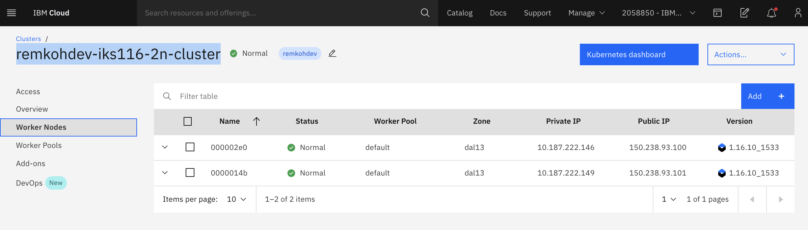

# Lab 01 - サービスタイプ、Ingressおよびネットワークポリシーを使用してアプリケーションアクセスを制御するKubernetesのネットワーク

Self: https://github.com/remkohdev/kubernetes-networking

このラボでは、いくつかの方法を使用して、Kubernetes クラスタ上のアプリケーションへのアクセスを制御します。 Kubernetes ネットワーキングの原則を確認し、ClusterIP、NodePort、LoadBalance rなどのさまざまなタイプのサービスリソースを適用します。また、Calico のポリシーについても簡単に説明しながら、Ingress リソースとネットワークポリシーを実装します。

ラボを体験するためにはIBM アカウントが必要です。 [Account Setup and Cluster Access](../lab-00/README.md) をご確認ください。

最初のステップでは、クラスターにアクセスし、MongoDB インスタンスと HelloWorld アプリケーションをデプロイします。これには約15分かかります。

ラボの残りの部分では、さまざまな Service タイプ、Ingress、ネットワークポリシーを作成します。

## 00. クラスタにアクセスする

[Account Setup and Cluster Access](../lab-00/README.md) の指示に従って、事前に作成されたクラスター環境を入手します。 `Access` ページに移動して、ログイン手順を進めてください。

https://shell.cloud.ibm.com から Cloud Shell にアクセスし、リモートクラスターにログインします。

CLUSTERNAME 環境変数を、ご自身のクラスターの名前に設定します。

```
$ export CLUSTERNAME=<YOUR CLUSTERNAME>
```

ログインして、クラスター構成をダウンロードします。

```
$ ibmcloud login 
$ ibmcloud ks cluster config --cluster $CLUSTERNAME
```

## 01. MongoDB のセットアップ

まず、MongoDBデータベースと、メッセージをMongoDBに格納するHelloWorldアプリケーションをデプロイします。

Helmを使用して、Bitnami / MongoDBチャートをデプロイおよび構成します。 [Deploy MongoDB](MONGODB.md) に移動して、HelloWorldアプリ用にMongoDBをセットアップしてください。


## 02. HelloWorldアプリをデプロイする

これでMongoDBがインストールされました。 [Deploy a HelloWorld App with ClusterIP](JAVAAPP.md) の指示に従ってアプリをデプロイします。

## Services

これで、Kubernetes Networkingの実際のラボから始めることができます。

`HelloWorld` という Java Spring Boot App を作成したときに、Deploymentを作成しました。デプロイによって、pod のレプリカが1つあるレプリカセットも作成されました。しかしながら、ポッドで実行されている `helloworld` コンテナの Service を作成しなかったため、まだアクセスできません。

Pod が worker node にデプロイされると、172.30.0.0/16 のレンジの `private IP address` が割り当てられます。worker node と pod は、プライベートIPアドレスを使用してプライベートネットワークで安全に通信できます。

ただし、Kubernetes は Pod を動的に作成および破棄するため、Pod の場所、つまりプライベートIPアドレスが変更されます。

`Service` オブジェクトを使用すると、組み込みの Kubernetes `service discovery` を使用して pod を公開できます。Service は、一連の pod とそれらの pod にアクセスするためのポリシーを定義します。 Kubernetes は一連の pod に単一の DNS 名を割り当て、pod 間でリクエストを負荷分散できます。Service を作成すると、一連の pod と `EndPoints` が作成され、pod へのアクセスが管理されます。

Kubernetes の Endpoints オブジェクトは、pod へのIPアドレスとポートアドレスのリストであり、サービスが作成されると自動的に作成され、Serviceで定義されたセレクターと一致する pod で構成されます。Service はセレクタなしで構成できます。その場合、 Kubernetes は関連する Endpoints オブジェクトを作成しません。

`service.yaml` ファイルで宣言した内容についてみてみましょう。

```
$ cat service.yaml

apiVersion: v1
kind: Service
metadata:
  name: helloworld
  labels:
    app: helloworld
spec:
  ports:
  - port: 8080
    targetPort: http-server
  selector:
    app: helloworld
```


仕様では、いくつかの重要な属性、特に `selector` と `ports' が定義されています。サービスが対象とするポッドのセットは、ラベルを使用してセレクターによって決定されます。サービスにセレクタがない場合、対応する `Endpoints` オブジェクトは自動的に作成されません。これは、外部データベースインスタンスの場合など、Endpoint を手動で定義する場合に役立ちます。

Service は、受信 `port` を `Deployment` の `targetPort` にマップします。デフォルトでは、`targetPort` は着信ポートフィールドと同じ値に設定されます。`port` のポート定義に名前を付けることもできます。ポート番号を使用する代わりに、サービスの `targetPort` 属性でこれらの名前を参照できます。 `helloworld` のサービスの例では、 `deployment.yaml` ファイルに、Service が名前で参照する対応するポートが定義されている必要があります。

```
$ cat deployment.yaml

ports:
- name: http-server
  containerPort: 8080
```

## ServiceTypes


`helloworld` アプリケーションのServiceを作成する前に、まず、存在するサービスのタイプを理解しましょう。 Kubernetes `ServiceTypes` を使用すると、必要なサービスの種類を指定できます。

デフォルトのタイプは `ClusterIP` です。サービスを外部IPアドレスに公開するには、ClusterIP 以外の ServiceType を作成する必要があります。

`ServiceType` の値と動作する内容は次のとおりです:

- **ClusterIP**: Exposes the Service on a cluster-internal IP. This is the default ServiceType.
- **NodePort**: Exposes the Service on each Node’s IP at a static port (the NodePort). A ClusterIP Service, to which the NodePort Service routes, is also automatically created. You’ll be able to contact the NodePort Service, from outside the cluster, by requesting <Node-Public-IP>:<NodePort>.
- **LoadBalancer**: Exposes the Service externally using a cloud provider’s load balancer. The NodePort and ClusterIP Services, to which the external load balancer routes, are also automatically created.
- **ExternalName**: Maps the Service to the contents of the externalName field (e.g. foo.bar.example.com), by returning a CNAME record.

[ExternalName Service](https://kubernetes.io/docs/concepts/services-networking/service/#externalname) セレクターがなく、代わりにDNS名を使用するサービスの特殊なケースです。 

```
apiVersion: v1
kind: Service
metadata:
  name: my-database-svc
  namespace: prod
spec:
  type: ExternalName
  externalName: my.database.example.com
```

この例では、クラスターでサービス `my-database-svc.prod.svc.cluster.local` を要求すると、クラスターDNSサービスが `my.database.example.com` のCNAMEレコードを返します。

Serviceの代わりに `Ingress` を使用して、HTTP/HTTPS サービスを公開することもできます。ただし、Ingress は技術的には ServiceType ではありませんが、クラスターのエントリポイントとして機能し、ルーティングルールを単一のリソースに統合できます。


## 03. ClusterIP

### `helloworld` にServiceを追加する

これで、Kubernetes のさまざまな ServiceType について簡単に理解できたので、Service を使用して `helloworld` の Deployment を公開します。

デフォルトのタイプで Service オブジェクトを作成します。前の手順で HelloWorld アプリをデプロイしたときに Service リソースファイルをすでに作成しています。

```
$ kubectl create -f service.yaml
service/helloworld created
```

Service 概要について確認してみましょう。

```
$ kubectl describe svc helloworld
Name:              helloworld
Namespace:         default
Labels:            app=helloworld
Annotations:       <none>
Selector:          app=helloworld
Type:              ClusterIP
IP:                172.21.161.255
Port:              <unset>  8080/TCP
TargetPort:        http-server/TCP
Endpoints:         172.30.153.79:8080
Session Affinity:  None
Events:            <none>
```

Kubernetes がデフォルトで `ClusterIP` タイプのサービスを作成することが分かります。これでサービスが利用可能になり、検出可能になりますが、クラスター内のみです。

Service の一部として作成された endpoints を取得してみます。

```
$ kubectl get endpoints helloworld
NAME         ENDPOINTS                                                  AGE
helloworld   172.30.153.79:8080   43s
```

完全なエンドポイントリソースの内容を確認するために、 `kubectl edit` コマンドを使用しますが、変更は行わないでください。

```
$ kubectl edit endpoints helloworld

apiVersion: v1
kind: Endpoints
metadata:
  name: helloworld
  namespace: default
  labels:
    app: helloworld
subsets:
  - addresses:
      - ip: 172.30.153.79
        targetRef:
          kind: Pod
          name: helloworld-5f8b6b587b-lwvcs 
```

`<ESC>` + `:q` を押して vim エディタから出ます。

Endpoints オブジェクトが Service オブジェクトを内部IPアドレスのポッドにマッピングするようになり、他のポッドが HelloWorld アプリケーションの Service にアクセスできるようになります。

## 04. NodePort

HelloWorld Service は現在アクセス可能ですが、クラスター内でのみアクセスできます。Service を外部IPアドレスに公開するには、ClusterIP 以外の ServiceType を作成する必要があります。クラスター内のアプリは、Service のクラスター内IPを使用するか、Service の名前にリクエストを送信することにより、pod にアクセスできます。Service の名前を使用すると、`kube-proxy` はクラスターDNSプロバイダーで名前を検索し、Service のクラスター内IPアドレスにリクエストをルーティングします。

kubernetesクラスターへの外部トラフィックを許可するには、`NodePort` ServiceType が必要です。 Service のタイプフィールドをNodePort に設定すると、Kubernetes は30000〜32767の範囲のポートを割り当てます。各ノードは、割り当てられた NodePort（すべてのノードで同じポート番号）をサービスにプロキシします。

`helloworld` の既存のサービスに `type: NodePort` をパッチします。

```
$ kubectl patch svc helloworld -p '{"spec": {"type": "NodePort"}}'
service/helloworld patched
```

Service の内容をもう一度、確認してみましょう。

```
$ kubectl describe svc helloworld

Name:                     helloworld
Namespace:                default
Labels:                   app=helloworld
Annotations:              <none>
Selector:                 app=helloworld
Type:                     NodePort
IP:                       172.21.161.255
Port:                     <unset>  8080/TCP
TargetPort:               http-server/TCP
NodePort:                 <unset>  31777/TCP
Endpoints:                172.30.153.79:8080
Session Affinity:         None
External Traffic Policy:  Cluster
Events:                   <none>
```

この例では、Kubernetesはこの例でポート値31777のNodePortを追加しました。誰にとっても、これは30000〜32767の範囲の別のポートである可能性があります。

これで、クラスター内の任意のワーカーノードの public IP address を介してサービスに接続でき、トラフィックはサービスに転送されます。Service はサービスの検出と Service のセレクターを使用して、割り当てられた pod にリクエストを配信します。これで、クラスター内のすべてのノードへの外部クライアント要求を負荷分散するための完全なパイプラインが完成しました。

Cloud Shellとibmcloud cliを使用して、クラスターが作成されたアカウントのクラスターのワーカーノードのpublic IPを取得するための十分な権限がありません。ただし、クラスターのワーカーノードは、IBM Cloud UIのクラスター詳細ページにあります。
https://cloud.ibm.com/kubernetes/clusters サイトからクラスターへアクセスします。クラスターを選択して `Worker Nodes` に移動し、いずれかのワーカーノードのPublic IPを探します。



十分な権限がある場合は、下記のコマンドを使用してクラスターのワーカーノードを表示できます。

```
$ ibmcloud ks worker ls --cluster $CLUSTERNAME
```

deployment をテストします。 PUBLICIP と NODEPORT の値の例では、PUBLIC_IP と NODEPORT がユーザーごとに異なることに注意してください。

```
$ PUBLICIP=150.238.93.100
$ NODEPORT=31110
$ curl "http://$PUBLICIP:$NODEPORT/api"
Welcome to Spring Boot App

$ curl "http://$PUBLICIP:$NODEPORT/api/hello?name=John"
{ "message" : "Hello John" }

$ curl "http://$PUBLICIP:$NODEPORT/api/messages"
[{"id":"5edda3befc271d2b0330b8a6","sender":"John","message":"Hello John"}]
```

クライアントは、ワーカーノードの public IP address を介してロードバランサーに接続します。ロードバランサーはノードを選択して接続します。 Kube-proxyはこの接続を受信し、クラスターIPのサービスに転送します。この時点で、リクエストは netfilter ルールに一致し、server pod にリダイレクトされます。

# 05. Loadbalancer

前のステップでは、clusterIP を使用して`helloworld` アプリケーションのサービスを作成し、そのサービスに NodePort を追加しました。ただし、クライアントが内部ネットワークであるかパブリックネットワーク経由で受信するかに関係なく、アプリケーションの前に何らかの種類のロードバランサーが必要です。ロードバランサーはリバースプロキシとして機能し、ネットワークまたはアプリケーションのトラフィックを複数のサーバーに分散します。


クラスター内のノードにクライアントトラフィックを分散するためのリバースプロキシとしてロードバランサーを使用するには、クライアントが接続できるサービスのパブリックIPアドレスと、ロードバランサーが接続するノード自体のIPアドレスが必要です。リクエストを転送できます。

`LoadBalancer` のサービスには、NodePort サービスのすべての機能だけでなく、完全な入力パスを構築する機能もあります。 `LoadBalancer` にもいくつかの制限があります： httpsトラフィックを終了するようにロードバランサーを構成したり、仮想ホストやパスベースのルーティングを実行したりできないため、単一のロードバランサーを使用して複数のサービスにプロキシすることはできません。これらの制限により、ロードバランサーを設定するための `Ingress` と呼ばれる個別のkubernetesリソースが追加されました（詳しくは次のセクションを参照）。

外部ロードバランサーをサポートするクラウドプロバイダーでは、 `type` フィールドを `LoadBalancer` に設定すると、サービスにロードバランサーがプロビジョニングされます。ロードバランサーの実際の作成はサービスと非同期で行われるため、ロードバランサーが作成されるまで待機する必要がある場合があります。

### IKSのロードバランサー

LoadBalancer サービスタイプの実装は、クラスターのインフラストラクチャプロバイダーによって異なります。 IKS（IBM Kubernetes Service）では、`classic cluster` はデフォルトでネットワークロードバランサー（NLB）1.0を実装します。

### 負荷分散方法

`helloworld` アプリケーション用の `NLB v1.0 +subdomain` を使用してロードバランサーを作成する前に、IKS のさまざまな負荷分散方法を確認してみましょう:

- `NodePort` ワーカーノードのポートとパブリックIPアドレスを介してアプリを公開します。
- `NLB v1.0 + subdomain` は、IPアドレスまたはサブドメインでアプリを公開する基本的な負荷分散を使用します。
- `NLB v2.0 + subdomain` は、パケットではなく宛先アドレスを変更するダイレクトサーバーリターン （DSR） ロードバランシングを使用し、IPアドレスまたはサブドメインでアプリを公開し、SSL終了をサポートします。 (Network load balancer (NLB) 2.0 はbetaです。)
- `Istio + NLB subdomain` は、アプリをサブドメインで公開し、Istio ルーティングルールを使用する基本的な負荷分散を使用します。
- `Ingress with public ALB` (Application Load Balancing) アプリをサブドメインで公開する HTTPS 負荷分散を使用し、複数のアプリに対してカスタムルーティングルールと SSL 終了を使用します。 [annotations](https://cloud.ibm.com/docs/containers?topic=containers-ingress_annotation) を使用してALBルーティングルールをカスタマイズできます。 (詳細は次のセクションを参照)
- `Custom Ingress + NLB subdomain` は、IBM 提供のALBサブドメインでアプリを公開し、カスタムルーティングルールを使用するカスタム入力でHTTPS 負荷分散を使用します。

### Network Load Balancer v1.0 の作成

前のラボでは、 `NodePort` サービスを作成しました。 `helloworld` の Service にパッチを適用し、タイプを `LoadBalancer` に変更します。

```
$ kubectl patch svc helloworld -p '{"spec": {"type": "LoadBalancer"}}'
service/helloworld patched
```

クラスターに複数のワーカーノードがある場合、LoadBalancerが作成され、サービスにアクセスするために外部IPアドレスが割り当てられます。

```
$ kubectl get svc helloworld
NAME    TYPE    CLUSTER-IP    EXTERNAL-IP    PORT(S)    AGE
helloworld   LoadBalancer   172.21.161.255   169.48.67.163   8080:31777/TCP   24m
```

表示される最大の違いは、サービスの外部IPアドレスの存在です。

または、 `helloworld` Service 概要について確認してみましょう。

```
$ kubectl describe svc helloworld
```

LoadBalancer のサービスが作成され、4つの利用可能なポータブルパブリックIPアドレスのうちの1つがサービスに割り当てられました。 IBM Cloud で標準クラスターを作成すると、IKSはポータブルパブリックサブネットとポータブルプライベートサブネットを自動的にプロビジョニングします。

インターネットから `helloworld` のサービスの NLB にアクセスするには、NLB の public IP address とサービスの割り当てられたポートを`<External_IP_Address>：<NodePort>` の形式で使用できます。 NodePorts は、クラスター内のすべてのワーカーノードのすべての public IP address と private IP address でアクセスできます。

ブラウザまたはCurlを使用して `helloworld`アプリにアクセスします。
```
$ EXTERNALIP=169.48.67.163
$ curl "http://$EXTERNALIP:$NODEPORT/api/hello?name=MeAgain" 
{ "message" : "Hello MeAgain" }

$ curl "http://$EXTERNALIP:$NODEPORT/api/messages"
[{"id":"5ee6e6206e986548955388ee","sender":"John","message":"Hello John"},{"id":"5ee6e72e6e986548955388ef","sender":"MeAgain","
message":"Hello MeAgain"}]
```

## 06. Ingress

`Ingress` は、技術的にはServiceではなく、コンテナクラスタのロードバランサーとルーターです。クラスタ内のサービスへの外部アクセスを管理するKubernetes APIオブジェクトです。`Ingress`を使用して、一意のパブリックまたはプライベートルートを使用することにより、複数のアプリサービスをパブリックまたはプライベートネットワークに公開できます。 Ingress APIは、TLSターミネーション、仮想ホスト、およびパスベースのルーティングもサポートしています。

標準クラスタを作成すると、Ingressサブドメインがデフォルトでクラスタにすでに登録されます。詳しくは前の手順を参照してください。アプリサービスへのパスは、デフォルトのIngressサブドメインのこのパブリックルートに追加されます。

IKSの標準クラスタでは、Ingress `Application Load Balancer（ALB` が `NGINX` Ingressコントローラーを実装します。 NGINXは、より一般的なロードバランサーとリバースプロキシの1つです。

Ingressを使用してアプリを公開するには、最初に `Ingress`リソースを定義する必要があります。Ingressリソースは、アプリのincomingリクエストをルーティングする方法のルールを定義するKubernetesリソースです。

アプリを公開するネームスペースごとに1つのIngressリソースが必要です。

## Ingress の HelloWorld の変更

Ingress サブドメイン経由で `HelloWorld` にアクセスし、パス`/ hello` 経由でパスルールにアクセスしたいとします。

Ingress リソースを構成するには、クラスターの Ingress サブドメインとIngress シークレットが必要です。クラスタの概要ページに移動して、Ingress サブドメインとシークレットを確認します。


The `Ingress Secret` will be the first part of the 
`Ingress Subdomain` of your cluster. E.g. if the `Ingress Subdomain` is the following:
```
remkohdev-iks116-294603-2bef1f4b4097001da9502000c44fc2b2-0000.us-south.containers.appdomain.cloud
```
Then the `Ingress Secret` will be,
```
remkohdev-iks116-294603-2bef1f4b4097001da9502000c44fc2b2-0000
```

The `Ingress Subdomain` has a format like `clustername-<hash>.region.containers.appdomain.cloud`.

アカウント管理権限がある場合は、CLIで `ibmcloud` コマンドを使用して、Ingress サブドメインとシークレットを取得できます。

```
$ ibmcloud ks nlb-dns ls --cluster $CLUSTERNAME
OK
Hostname    IP(s)    Health Monitor    SSL Cert Status    SSL Cert Secret Name    Secret Namespace
remkohdev-iks116-294603-2bef1f4b4097001da9502000c44fc2b2-0000.us-south.containers.appdomain.cloud    169.48.67.162    None    created    remkohdev-iks116-294603-2bef1f4b4097001da9502000c44fc2b2-0000    default 
```

または下記を実行します。

```
$ ibmcloud ks cluster get --show-resources -c $CLUSTERNAME
```

Ingress サブドメインと Ingress シークレットを取得したら、 `rewrite path` アノテーションを使用して、次のコマンドで Ingress リソースを作成します。

以下のファイルで、 `hosts` と `host` をクラスターの `Ingress Subdomain` に変更し、`secretName` をクラスターの値 `Ingress Secret` に変更してください。

```
$ echo 'apiVersion: extensions/v1beta1
kind: Ingress
metadata:
  name: helloworld-ingress
  annotations:
    ingress.bluemix.net/rewrite-path: serviceName=helloworld rewrite=/
spec:
  tls:
  - hosts:
    - <Ingress Subdomain>
    secretName: <Ingress Secret>
  rules:
  - host: <Ingress Subdomain>
    http:
      paths:
      - path: /hello
        backend:
          serviceName: helloworld
          servicePort: 8080' > ingress.yaml
```

`hosts`、`secretName`、 `host`の値を必ず変更し、`ingress.yaml` ファイルを編集して必要な変更を加えます。

```
$ vi ingress.yaml
```

次に、helloworld の Ingress を作成します。

```
$ kubectl create -f ingress.yaml
ingress.extensions/helloworld-ingress created
```

上記のリソースは、 `https://remkohdev-iks116-2n-clu-2bef1f4b4097001da9502000c44fc2b2-0000.us-south.containers.appdomain.cloud/hello` と同様のhelloworld へのアクセスパスを作成します。

さらに、 [customize Ingres routing with annotations](https://cloud.ibm.com/docs/containers?topic=containers-ingress_annotation) によって Ingress ルーティングをカスタマイズし、ALB 設定、TLS 設定、要求と応答のアノテーション、サービス制限、ユーザー認証、またはエラーアクションなどをカスタマイズできます。

サービスへのパスを持つ Ingress サブドメインを使用して、 `helloworld` APIとプロキシにアクセスしてみてください。

```
$ HOST=remkohdev-iks116-294603-2bef1f4b4097001da9502000c44fc2b2-0000.us-south.containers.appdomain.cloud

$ curl "http://$HOST/hello/api/hello?name=JaneDoe" 
{ "message" : "Hello JaneDoe" }

$ curl "http://$HOST/hello/api/messages"
[{"id":"5ee27306040cd720fa7ba32d","sender":"John","message":"Hello John"},{"id":"5ee274e7040cd720fa7ba32e","sender":"MeAgain","message":"Hello MeAgain"},{"id":"5ee2f325040cd720fa7ba32f","sender":"JaneDoe","message":"Hello JaneDoe"}]
```

URI パスではなくサブドメインパスを使用する場合は、ホスト属性にサブドメインプレフィックスを追加します。サブドメインパスの作成はスキップしますが、次の例を確認してください。
```
apiVersion: extensions/v1beta1
kind: Ingress
metadata:
  name: helloworld-ingress
spec:
  tls:
  - hosts:
    - remkohdev-iks116-3x-clu-2bef1f4b4097001da9502000c44fc2b2-0000.us-south.containers.appdomain.cloud
    secretName: remkohdev-iks116-3x-clu-2bef1f4b4097001da9502000c44fc2b2-0000
  rules:
    - host: >-
        hello.remkohdev-iks116-2n-clu-2bef1f4b4097001da9502000c44fc2b2-0000.us-south.containers.appdomain.cloud
      http:
        paths:
          - backend:
              serviceName: helloworld
              servicePort: 8080
    - host: >-
        helloproxy.remkohdev-iks116-2n-clu-2bef1f4b4097001da9502000c44fc2b2-0000.us-south.containers.appdomain.cloud
      http:
        paths:
          - backend:
              serviceName: helloworld-proxy
              servicePort: 8080
```

この Ingress リソースは、 https://hello.remkohdev-iks116-2n-clu-2bef1f4b4097001da9502000c44fc2b2-0000.us-south.containers.appdomain.cloud/ で app1 へのアクセスパスを作成します。


## 07. Network Policy

Kubernetesネットワーキングラボのこの最後のセクションでは、 `default` namespace の HelloWorld アプリケーションからのトラフィックのみを許可し、` test` namespace の別の HelloWorld アプリケーションからのトラフィックを許可しないネットワークポリシーを作成します。

そこでまず、 `test` という namespace に HelloWorld アプリケーションの新しいインスタンスを作成します。

下記のコマンドで新しいnamespace `test`を作成します。

```
$ kubectl create namespace test
```

`test` namespace に、`default` namespace の同じ MongoDB サービスに接続する HelloWorld の2番目のデプロイメントを作成します。 Kubernetesデプロイメントリソースを作成します。

```
$ echo 'apiVersion: apps/v1
kind: Deployment
metadata:
  name: helloworld2
  namespace: test
  labels:
    app: helloworld2
spec:
  replicas: 1
  selector:
    matchLabels:
      app: helloworld2
  template:
    metadata:
      labels:
        app: helloworld2
    spec:
      containers:
      - name: helloworld2
        image: remkohdev/helloworld:lab1v1.0
        ports:
        - name: http-server
          containerPort: 8080' > deployment2.yaml
```

`test` namespace に kubernetes サービスリソースを作成します。

```
$ echo 'apiVersion: v1
kind: Service
metadata:
  name: helloworld2
  namespace: test
  labels:
    app: helloworld2
spec:
  type: LoadBalancer
  ports:
  - port: 8080
    targetPort: http-server
  selector:
    app: helloworld2
' > service2.yaml
```

Deploy the Kubernetes Deployment and Service resource for HellWorld2 in the `test` namespace using the shared MongoDB instance in the `default` namespace,

`default` namespace の共有 MongoDB インスタンスを使用して、HellWorld2 の Kubernetes デプロイとサービスリソースを `test` namespace にデプロイします。

```
$ kubectl create -f deployment2.yaml
$ kubectl create -f service2.yaml
```

新しいサービスの外部IPと NodePort を取得します。

```
$ kubectl get svc helloworld2 -n test
NAME          TYPE           CLUSTER-IP      EXTERNAL-IP    PORT(S)          AGE
helloworld2   LoadBalancer   172.21.176.80   169.48.215.4   8080:31429/TCP   34s
```

MongoDB インスタンスへの接続をテストします。

    ```
    $ EXTERNALIP2=169.48.215.4
    $ NODEPORT2=31429

    $ curl http://$EXTERNALIP2:$NODEPORT2/api/messages
    [{"id":"5edda3befc271d2b0330b8a6","sender":"john","message":"Hello john"},{"id":"5edda81e9a848c335b5d1e40","sender":"john","message":"Hello john"},{"id":"5eddac2e9a848c335b5d1e41","sender":"MeAgain","message":"Hello MeAgain"},{"id":"5eddb2269a848c335b5d1e42","sender":"JaneDoe","message":"Hello JaneDoe"}]
    ```

新しいメッセージを取得します。

```
$ curl http://$EXTERNALIP2:$NODEPORT2/api/hello?name=Joe2
{ "message" : "Hello Joe2" }
```

### Network Policy

ネットワークポリシーは、pod が相互に通信したり、他のネットワークエンドポイントと通信したりする方法の仕様です。 NetworkPolicy は、ラベルを使用してポッドを選択し、許可するトラフィックを指定するルールを定義します。 `policyTypes` フィールドには、` Ingress`、 `Egress`、またはその両方が含まれます。 ingress/egressの各ルールは、from/toセクションと ports セクションの両方に一致するトラフィックを許可します。

ingress `from` セクションまたは egress `to` セクションには4種類のセレクターがあります:
- podSelector,
- namespaceSelector,
- podSelector および namespaceSelector,
- IP CIDR レンジ の ipBlock。

すべての IBM Cloud Kubernetes Service クラスターには、Calico と呼ばれるネットワークプラグインが設定されています。デフォルトのネットワークポリシーは、クラスター内のすべてのワーカーノードのパブリックネットワークインターフェイスを保護するように設定されています。 Kubernetesと Calico を使用して、クラスターのネットワークポリシーを作成できます。

Kubernetes ネットワークポリシーが適用されると、Calico がそれをIptables ルールとして適用できるように、自動的に Calico ネットワークポリシーに変換されます。 Calico ネットワークポリシーは、Kubernetesネットワークポリシーのスーパーセットであり、calicoctl コマンドを使用して適用されます。 Calico はポリシーを実施します。

Calico は、NetworkPolicy リソースと GlobalNetworkPolicy リソースの2つのポリシーリソースを使用します。ネットワークポリシーは、名前空間内のpods/containers/VMs に適用される名前空間付きのリソースです。

```
apiVersion: projectcalico.org/v3
kind: NetworkPolicy
```

Calico グローバルネットワークポリシーは非名前空間リソースであり、namespace とは無関係にあらゆる種類のエンドポイント (pods、VMs、ホストインターフェイス) に適用できます。

```
apiVersion: projectcalico.org/v3
kind: GlobalNetworkPolicy
```

Calico NetworkPolicy または GlobalNetworkPolicy リソースを作成するには、calicoctl CLI をインストールする必要があります。このラボでは少し時間がかかりすぎるため、このハンズオンラボには Calico ラボは含まれません。

`test` namespace との間のすべてのトラフィックをブロックするには、次のネットワークポリシーを作成します。

```
$ echo 'kind: NetworkPolicy
apiVersion: networking.k8s.io/v1
metadata:
    name: test-deny
    namespace: test
spec:
  podSelector:
    matchLabels: {}
  policyTypes:
  - Ingress
  - Egress' > deny-test-namespace.yaml
```

次に、Kubernetesネットワークポリシーを作成します。

```
$ kubectl create -f deny-test-namespace.yaml
networkpolicy.networking.k8s.io/test-deny created
```

Kubernetes ネットワークポリシーが作成されると、自動的に Calico ネットワークポリシーに変換されることに注意してください。

外部IPおよび NodePort の LoadBalancer サービスの詳細を介して、test namespace の HelloWorld2 API にアクセスしてみます。

```
$ kubectl get svc helloworld2 -n test
$ curl http://$EXTERNALIP2:$NODEPORT2/api/messages
curl: (7) Failed to connect to 169.48.67.164 port 32401: Connection timed out
```

`test` namespace のサービスは、`default` namespace の MongoDB インスタンスにアクセスしようとするため失敗しますが、これは許可されていません。

次に `default` namespace の `helloworld` サービスの詳細を使用して、default namespace で HelloWorld API にアクセスしてみます。

```
$ kubectl get svc helloworld
$ curl http://$EXTERNALIP:$NODEPORT/api/messages
[{"id":"5edda3befc271d2b0330b8a6","sender":"john","message":"Hello john"},{"id":"5edda81e9a848c335b5d1e40","
sender":"john","message":"Hello john"},{"id":"5eddac2e9a848c335b5d1e41","sender":"MeAgain","message":"Hello 
MeAgain"},{"id":"5eddb2269a848c335b5d1e42","sender":"JaneDoe","message":"Hello JaneDoe"},{"id":"5edeee2a2e61
fc739ece0820","sender":"Joe2","message":"Hello Joe2"}]
```

`test-deny` ネットワークポリシーを再度削除します。

```
$ kubectl delete NetworkPolicy test-deny -n test
```

これで、helloworld2 からデフォルトの namespace へのトラフィックが再び許可されます。

```
$ curl http://$EXTERNALIP2:$NODEPORT2/api/messages
[{"id":"5ee6e6206e986548955388ee","sender":"John","message":"Hello John"},{"id":"5ee6e72e6e986548955388ef","sender":"MeAgain","message":"Hello MeAgain"},{"id":"5ee6e9c56e986548955388f0","sender":"JaneDoe","message":"Hello JaneDoe"},{"id":"5ee6eb4574416c3c675a01a2","sender":"Joe2","message":"Hello Joe2"}]
```

または、すべてのトラフィックを明示的に再び許可するには、次の NetworkPolicy を作成します。

```
$ echo 'apiVersion: networking.k8s.io/v1
kind: NetworkPolicy
metadata:
  name: allow-all-ingress
spec:
  podSelector: {}
  ingress:
  - {}
  policyTypes:
  - Ingress' > allow-all.yaml
```

新しい NetworkPolicy を再度作成します。

```
$ kubectl create -f allow-all.yaml
```

## 作成したリソースの削除方法

`helloworld2` リソースを削除するには、 下記のコマンドで namespace` test`を削除します。

```
$ kubectl delete namespace test
```

NetworkPolicy を削除するコマンドは下記の通りです。

```
$ kubectl delete networkpolicy test-deny
$ kubectl delete networkpolicy allow-all-ingress
```

Ingress リソースを削除するコマンドは下記の通りです。

```
$ kubectl delete ingress helloworld-ingress
```

`helloworld` アプリケーション用に作成したリソースをクリーンアップするには、次のコマンドを実行します。

```
$ kubectl delete deploy helloworld
$ kubectl delete svc helloworld
```

以上です。

[Lab 2](../lab-02/README.md) に進むか、[Summary](../SUMMARY.md) に戻ります。

