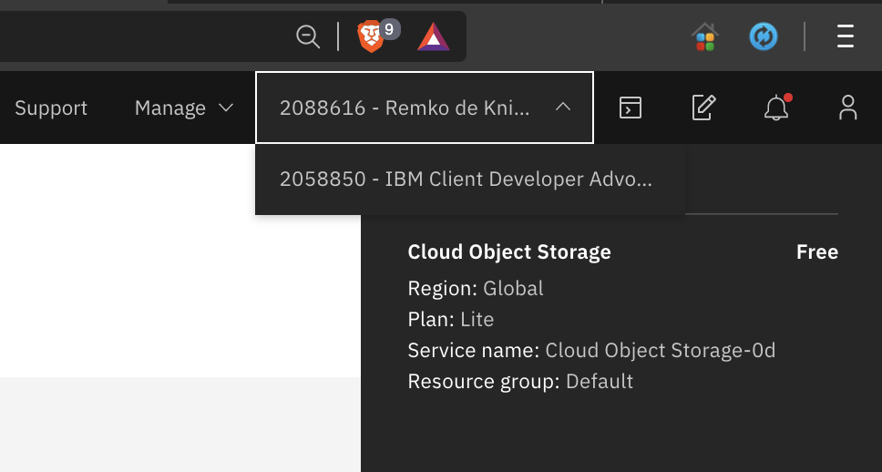
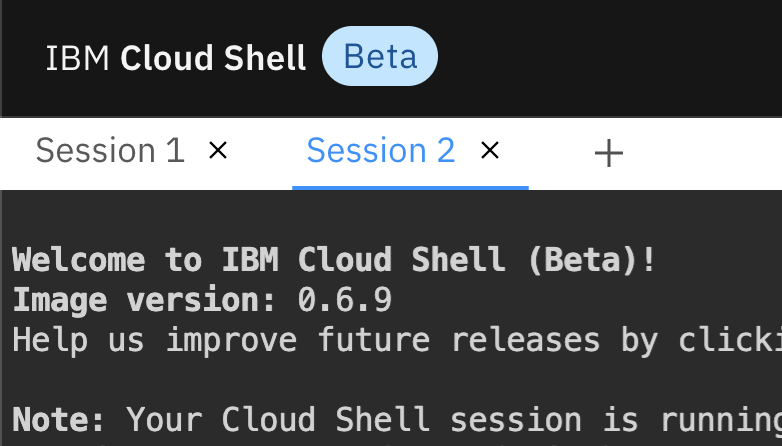
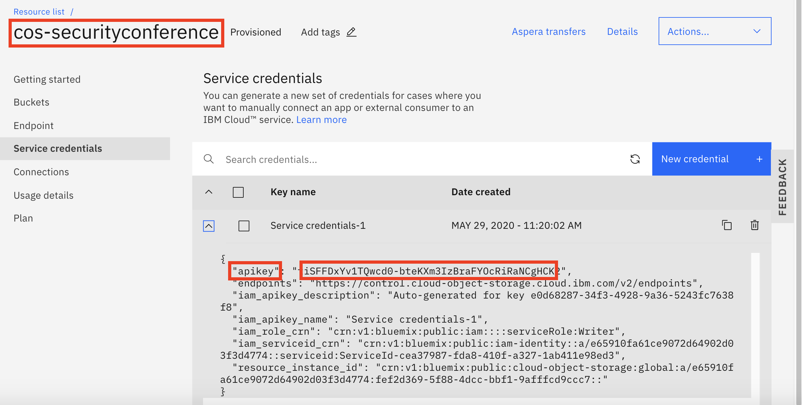
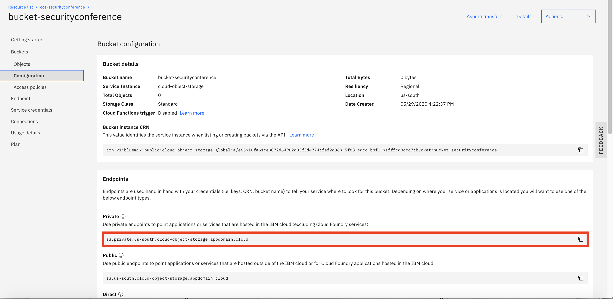
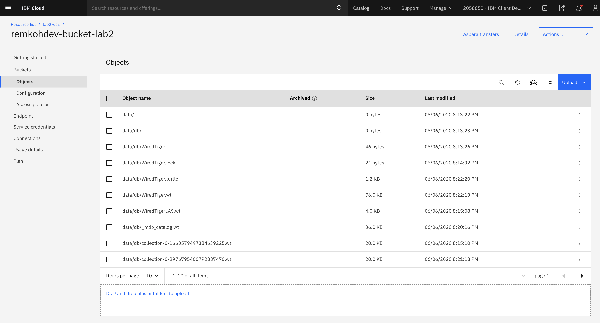

# Lab02 - Adding Secure Encrypted Object Storage using a Persistent Volume for MongoDB with S3FS-Fuse

## Pre-requisites

Before starting the exercise, you need to have
- an IBM Cloud account
- an instance of IBM Kubernetes Service (https://cloud.ibm.com/kubernetes/catalog/create)
- an instance of IBM Cloud Object Storage (https://cloud.ibm.com/catalog/services/cloud-object-storage)
- access to the IBM Cloud Shell,


## Overview of IBM Cloud Object Storage

An important part of data security and persistence on Kubernetes depends on physical storage outside the container orchestration engine that Kubernetes is. You can use PersistentVolume and PersistentVolumeClaim to map data directories to external physical storage. But also, data persistence on a stateless platform like Kubernetes should require extra attention.

IBM Cloud Object Storage (COS) offers a few exceptional features that help secure data on Kubernetes. IBM Cloud Object Storage (COS) actively participates in several industry compliance programs and provides the following compliance, certifications, attestations, or reports as measure of proof:
- ISO 27001,
- PCI-DSS for Payment Card Industry (PCI) USA,
- HIPAA for Healthcare USA, (including administrative, physical, and technical safeguards required of Business Associates in 45 CFR Part 160 and Subparts A and C of Part 164),
- ISO 22301 Business Continuity Management,
- ISO 27017,
- ISO 27018,
- ISO 31000 Risk Management Principles,
- ISO 9001 Quality Management System,
- SOC1 Type 2 (SSAE 16), (System and Organization Controls 1),
- SOC2 Type 2 (SSAE 16), (System and Organization Controls 2),
- CSA STAR Level 1 (Self-Assessment),
- General Data Protection Regulation (GDPR) ready,
- Privacy shield certified.

At a high level, information on IBM Cloud Object Storage (COS) is encrypted, then dispersed across multiple geographic locations, and accessed over popular protocols like HTTP with a RESTful API.

SecureSlice distributes the data in slices across geo locations so that no full copy of data exists on any individual storage node, and automatically encrypts each segment of data before it is erasure coded and dispersed. 

The content can only be re-assembled through IBM Cloud’s `Accesser` technology at the client’s primary data center, where the data was originally received, and decrypted again by SecureSlice. 

`Data-in-place` or `data-at-rest` security is ensured when you persist database contents in IBM Cloud Object Storage. 

You also have a choice to use integration capabilities with IBM Cloud Key Management Services like IBM Key Protect (using FIPS 140-2 Level 3 certified hardware security modules (HSMs)) and Hyper Protect Crypto Services (built on FIPS 140-2 Level 4-certified hardware) for enhanced security features and compliance.


## Overview of IBM Cloud Object Storage Plugin

This lab uses the [IBM Cloud Object Storage plugin](https://github.com/IBM/ibmcloud-object-storage-plugin) to connect an encrypted Object Storage to the Kubernetes cluster via `PersistentVolume`. A MongoDB database is setup that persists its data to a highly encrypted IBM `Cloud Object Storage` through PersistentVolume. A sample Java Spring Boot application stores its data in the MongoDB database and its data gets encrypted and persisted.

`IBM Cloud Object Storage plugin` is a Kubernetes volume plugin that enables Kubernetes pods to access IBM Cloud Object Storage buckets. The plugin has two components: a dynamic provisioner and a FlexVolume driver for mounting the buckets using `s3fs-fuse` on a worker node.

[`s3fs`](https://github.com/s3fs-fuse/s3fs-fuse) allows Linux and macOS to mount an S3 bucket via FUSE.


### IBM Cloud Shell

The `IBM Cloud Shell` is a web-based terminal running as a container on a Kubernetes cluster in the IBM Cloud. It provides common CLIs when you work with container, kubernetes and OpenShift related technologies. The steps in this exercise are written and tested in the `Cloud Shell` environment.

## Lab 

1. Login to [IBM Cloud](https://cloud.ibm.com).

2. Start an instance of `Cloud Shell` by either clicking its icon at the top-right corner of the screen or using the url `https://shell.cloud.ibm.com` in a new browser tab.

    > Note: most of steps in this exercise will be performed in `Cloud Shell`.

    > Important: A `Cloud Shell` session times out after it's idle for more than 60 minutes. When a `Cloud Shell` session times out, you'll lose every work that was performed during the session, if it's not persistent. For example, any CLI tool installation in a `Cloud Shell` will be lost after the session expires. Cloud Shell is a shell environment running in a container.

3. In the `Cloud Shell`, login to IBM Cloud from the CLI tool.

    ```
    $ ibmcloud login
    ```
    or if using Single Sign On,
    ```
    $ ibmcloud login -sso
    ```

4. Retieve your cluster information.

    ```
    $ ibmcloud ks clusters

    Name                              ID                     State    Created        Workers   Location          Version                   Resource Group Name   Provider   
    yourcluster                       br78vuhd069a00er8s9g   normal   1 day ago      1         Dallas            1.16.10_1533              default               classic   
    ```

5. For your convenience, store your IKS cluster name in a environment variable `CLUSTERNAME` for future reference.

    ```
    $ export CLUSTERNAME=<your cluster name>
    ```

6. Connect to your cluster instance.

    ```
    $ ibmcloud ks cluster config --cluster $CLUSTERNAME

    Added context for leez-iks-1node to the current kubeconfig file.
    You can now execute 'kubectl' commands against your cluster. For example, run 'kubectl get nodes'.
    ```

7. Verify the connection to your cluster.

    ```
    $ kubectl config current-context
    $ kubectl get nodes
    ```

### Installing Helm v3

You are going to install `IBM Cloud Object Storage Plugin` via Helm v3 CLI. At the time of writing, by default, Helm v2.16 was installed on the `Cloud Shell`. 

1. In the `Cloud Shell`, download and unzip Helm v3.2.

    ```
    $ wget https://get.helm.sh/helm-v3.2.0-linux-amd64.tar.gz
    $ tar -zxvf helm-v3.2.0-linux-amd64.tar.gz
    ```

2. Make Helm v3 CLI available in your `PATH` environment variable.

    ```
    $ echo 'export PATH=$HOME/linux-amd64:$PATH' > .bash_profile
    $ source .bash_profile
    ```

3. Verify Helm v3 installation.

    ```
    $ helm version --short

    v3.2.0+ge11b7ce
    ```

### Preparing IBM Cloud Object Storage Service Instance

If you have an existing `IBM Cloud Object Storage` service instance, you can use it for the remaining of the exercise.

1. If you don't have any `IBM Cloud Object Storage` service instance or prefer to create a new instance for this exercise, go to https://cloud.ibm.com/catalog/services/cloud-object-storage and create a Lite plan of Cloud Object Storage for free. You can only have 1 single free Lite instance per account.

2. Note, that if you are using a pre-created cluster you are now logged into a different account than your personal account, because the other account is where the clusters were created for you. On this other account you do not have permission to create new services, so switch to your personal account first before you create the new service.

    

3. If you are using the CLI to create a new service, in the `Cloud Shell` open a new session, and login to your personal account,

    

4. You also need a resource group at the time of writing, but none was created when you created a new account recently yet,

    Check if you already have a resource-group
    ```
    ibmcloud resource groups
    OK
    Name      ID                                 Default Group   State   
    Default   282d2f25256540499cf99b43b34025bf   true            ACTIVE   
    ```

    If you do not have a resource group yet, create one,

    ```
    $ ibmcloud resource group-create Default
    Creating resource group Default under account 5081ea1988f14a66a3ddf9d7fb3c6b29 as remko@remkoh.dev...
    OK
    Resource group Default was created.
    Resource Group ID: 93f7a4cd3c824c0cbe90d8f21b46f758
    ```

5. Create a new Object Storage instance via CLI command, for the lab you can use a `Lite` plan.

    ```
    $ ibmcloud resource service-instance-create <instance-name> cloud-object-storage <plan> global -g Default
    ```

    For example,

    ```
    $ ibmcloud resource service-instance-create cos-securityconference cloud-object-storage Lite global -g Default

    OK
    Service instance cos-securityconference was created.                 
    Name:             cos-securityconference   
    ID:               crn:v1:bluemix:public:cloud-object-storage:global:a/          
                        e65910fa61ce9072d64902d03f3d4774:fef2d369-5f88-4dcc-bbf1-9afffcd9ccc7::   
    GUID:             fef2d369-5f88-4dcc-bbf1-9afffcd9ccc7   
    Location:         global   
    State:            active   
    Type:             service_instance   
    Sub Type:            
    Allow Cleanup:    false   
    Locked:           false   
    Created at:       2020-05-29T15:55:26Z   
    Updated at:       2020-05-29T15:55:26Z   
    Last Operation:                   
                  Status    create succeeded      
                  Message   Completed create instance operation   
    ```

6. Now you need to add credentials. 

7. You can do this from the CLI,
    ```
    $ ibmcloud resource service-key-create my-cos-lab2-credentials Writer --instance-name "cos-securityconference" --parameters '{"HMAC":true}'

    $ ibmcloud resource service-key my-cos-lab2-credentials
    ```   

8. Or via the web UI. In a browser, navigate to `https://cloud.ibm.com/resources` which shows a list of your services providioned in your cloud account.

9. Expand the `Storage` section. 

10. Locate and select your `IBM Cloud Object Storage` service instance.

    

11. Navigate to the `Service credentials` tab.

    

12. Click on `New credential` button. 

13. Change the name to reference the Cloud Object Storage, e.g. `my-cos-lab2-credentials`

14. For `Role` accept `Writer`,

15. Accept all other default settings, and select `Add` to create a new one.

16. Expand your new service credentials, you will need the credentials to configure the persistent volume later, and take a note of 
    - `apikey` in your `Service credential` and 
    - `name` of your `IBM Cloud Object Storage` service instance.

    

17. For your convenience, in the `Cloud Shell` store information in environment variables, store the Object Storage service name in `COS_SERVICE` and the credentials apikey in `COS_APIKEY`. Store each environment variable in cloud shell sessions for both accounts if you are using both your personal account and the pre-created account. 

In the `Cloud Shell`, 

    ```
    $ export COS_SERVICE=cos-securityconference
    $ export COS_APIKEY=H4pWU7tKDIA0D95xQrDPmjwvA5JB4CuHXbCAn6I6bg5H
    ```

    > Note: replace the example values with your own! 

16. Retrieve `GUID` of your `IBM Cloud Object Storage` service instance. Note, that you should open a separate session in the cloud shell and be logged in to your own personal account. You have to be logged in to the account where the COS instance was created.

    ```
    $ ibmcloud resource service-instance $COS_SERVICE | grep GUID

    GUID:                  fef2d369-5f88-4dcc-bbf1-9afffcd9ccc7
    ```

17. For your convenience, store information in environment variable `COS_GUID`.

    ```
    $ export COS_GUID=fef2d369-5f88-4dcc-bbf1-9afffcd9ccc7
    ```

    > Note: replace the example value with your own GUID.

18. From the `Cloud Shell` logged in to the account where your cluster was created, create a `Kubernetes Secret` to store the COS service credentials named `cos-write-access`.

    ```
    $ kubectl create secret generic cos-write-access --type=ibm/ibmc-s3fs --from-literal=api-key=$COS_APIKEY --from-literal=service-instance-id=$COS_GUID

    secret/cos-write-access created
    ```

### Installing IBM Cloud Object Storage Plugin

You are going to install the `IBM Cloud Object Storage Plugin` in your cluster, using the Helm CLI tool in this section.

1. In the `Cloud Shell` with access to your remote cluster, add a Helm repository where `IBM Cloud Object Storage Plugin` chart resides.

    ```
    $ helm repo add ibm-charts https://icr.io/helm/ibm-charts

    `ibm-charts` has been added to your repositories
    ```

1. Refresh your local Helm repository.

    ```
    $ helm repo update

    Hang tight while we grab the latest from your chart repositories...
    ...Successfully got an update from the "ibm-charts" chart repository
    Update Complete. ⎈ Happy Helming!⎈ 
    ```

1. Download and unzip the `IBM Cloud Object Storage` plugin to your client, then install the plugin to your cluster from local client.

    ```
    $ helm pull --untar ibm-charts/ibm-object-storage-plugin
    $ ls -al
    $ helm plugin install ./ibm-object-storage-plugin/helm-ibmc

    Installed plugin: ibmc
    ```

1. Housekeeping to allow execution of the `ibmc.sh` script by making the file executable.

    ```
    $ chmod 755 $HOME/.local/share/helm/plugins/helm-ibmc/ibmc.sh
    ```

1. Verify the `IBM Cloud Object Storage` installation. The plugin usage information should be displayed when running the command below.

    ```
    $ helm ibmc --help
    ```

### Configuring IBM Cloud Object Storage Plugin

Before using the `IBM Cloud Object Storage Plugin`, configuration changes are required.

1. In the `Cloud Shell` where you downloaded the IBM Cloud Object Storage plugin, navigate to the templates folder of the `IBM Cloud Object Storage Plugin` installation.

    ```
    $ cd ibm-object-storage-plugin/templates && ls -al
    ```

1. Make sure the `provisioner-sa.yaml` file is present and configure it to access the COS service using the COS service credentials secret `cos-write-access` that you created in the previous section.

- Open file `provisioner-sa.yaml` in a editor.

    ```
    $ vi provisioner-sa.yaml
    ```

- Search for content `ibmcloud-object-storage-secret-reader` in the file. To move to the right section in the file, in the `vi` editor,
    - Type colon `:`
    - Type `/ibmcloud-object-storage-secret-reader`
    - Press `<ENTER>` key

- Find the section below in the `vi` editor. It's a few lines down.

    ``` 
    rules:
    - apiGroups: [""]
        resources: ["secrets"]
        #resourceNames: [""]
    ```

- Use the `<i>` key to change to `Insert` mode in vim, uncomment the line and change the section to set the secret to `cos-write-access` and allow access to the COS instance,

    ```
    rules:
    - apiGroups: [""]
        resources: ["secrets"]
        resourceNames: ["cos-write-access"]
    ```

- Save the change and quit the `vi` editor.
    - Press `<ESC>` key
    - Type `:wq`
    - Press <ENTER> key

Now, install the configured storage classes for `IBM Cloud Object Storage`,

1. In the `Cloud Shell`, navigate back to the user root folder.

    ```
    $ cd $HOME
    ```

2. Install the configured storage classes for `IBM Cloud Object Storage`, which will use the edited template file.

    ```
    $ helm ibmc install ibm-object-storage-plugin ./ibm-object-storage-plugin

    Helm version: v3.2.0+ge11b7ce
    Installing the Helm chart...
    PROVIDER: CLASSIC
    DC: hou02
    Chart: ./ibm-object-storage-plugin
    NAME: ibm-object-storage-plugin
    LAST DEPLOYED: Sat May 23 17:45:25 2020
    NAMESPACE: default
    STATUS: deployed
    REVISION: 1
    NOTES:
    Thank you for installing: ibm-object-storage-plugin.   Your release is named: ibm-object-storage-plugin
    ```

3. Verify that the storage classes are created successfully.

    ```
    $ kubectl get storageclass | grep 'ibmc-s3fs'

    ibmc-s3fs-cold-cross-region            ibm.io/ibmc-s3fs   43h
    ibmc-s3fs-cold-regional                ibm.io/ibmc-s3fs   43h
    ibmc-s3fs-flex-cross-region            ibm.io/ibmc-s3fs   43h
    ibmc-s3fs-flex-perf-cross-region       ibm.io/ibmc-s3fs   43h
    ibmc-s3fs-flex-perf-regional           ibm.io/ibmc-s3fs   43h
    ibmc-s3fs-flex-regional                ibm.io/ibmc-s3fs   43h
    ibmc-s3fs-standard-cross-region        ibm.io/ibmc-s3fs   43h
    ibmc-s3fs-standard-perf-cross-region   ibm.io/ibmc-s3fs   43h
    ibmc-s3fs-standard-perf-regional       ibm.io/ibmc-s3fs   43h
    ibmc-s3fs-standard-regional            ibm.io/ibmc-s3fs   43h
    ibmc-s3fs-vault-cross-region           ibm.io/ibmc-s3fs   43h
    ibmc-s3fs-vault-regional               ibm.io/ibmc-s3fs   43h
    ```

4. Verify that plugin pods are in "Running" state and indicate `READY` state of `1/1`:

    ```
    $ kubectl get pods -n kube-system -o wide | grep object

    ibmcloud-object-storage-driver-jwbcw                  1/1     Running   0          43h    10.185.199.31    10.185.199.31   <none>           <none>
    ibmcloud-object-storage-plugin-654fc7cd86-kcs8n       1/1     Running   0          43h    172.30.194.209   10.185.199.31   <none>           <none>
    ```

    If the pods are not `READY` and indicate `0/1` then wait and re-run the command until the `READY` state says `1/1`.

    The installation is successful when one `ibmcloud-object-storage-plugin` pod and one or more `ibmcloud-object-storage-driver` pods are in `running` state.

    The number of `ibmcloud-object-storage-driver` pods equals the number of worker nodes in your cluster. All pods must be in a `Running` state for the plug-in to function properly. If the pods fail, run `kubectl describe pod -n kube-system <pod_name>` to find the root cause for the failure.

5. Execute the command below until all pods are in `Running` state with `1/1`.

    ```
    $ kubectl get pods -n kube-system -o wide | grep object

    ibmcloud-object-storage-driver-jwbcw                  1/1     Running   0          43h    10.185.199.31    10.185.199.31   <none>           <none>
    ibmcloud-object-storage-plugin-654fc7cd86-kcs8n       1/1     Running   0          43h    172.30.194.209   10.185.199.31   <none>           <none>
    ```

### Review the Object Storage Configuration

IBM Cloud Kubernetes Service provides pre-defined storage classes that you can use to create buckets with a specific configuration.

1. List available storage classes in IBM Cloud Kubernetes Service.

    ```
    $ kubectl get storageclasses | grep s3
    ```

    The Lite service plan for Cloud Object Storage includes Regional and Cross Regional resiliency, flexible data classes, and built in security. For the sample application, I will choose the `standard` and `regional` options in the `ibmc-s3fs-standard-regional` storageclass that is typical for web or mobile apps and we don't need cross-regional resilience beyond resilience per zones for our workshop app, but the options to choose for usage strategies and therefor the pricing of storageclasses for the bucket is very granular.

1. Review the detailed IBM Cloud Object Storage bucket configuration for a storage class.

    ```
    $ kubectl describe storageclass ibmc-s3fs-standard-regional

    Name:                  ibmc-s3fs-standard-regional
    IsDefaultClass:        No
    Annotations:           meta.helm.sh/release-name=ibm-object-storage-plugin,meta.helm.sh/release-namespace=default
    Provisioner:           ibm.io/ibmc-s3fs
    Parameters:            ibm.io/chunk-size-mb=16,ibm.io/curl-debug=false,ibm.io/debug-level=warn,ibm.io/iam-endpoint=https://iam.bluemix.net,ibm.io/kernel-cache=true,ibm.io/multireq-max=20,ibm.io/object-store-endpoint=NA,ibm.io/object-store-storage-class=NA,ibm.io/parallel-count=2,ibm.io/s3fs-fuse-retry-count=5,ibm.io/stat-cache-size=100000,ibm.io/tls-cipher-suite=AESGCM
    AllowVolumeExpansion:  <unset>
    MountOptions:          <none>
    ReclaimPolicy:         Delete
    VolumeBindingMode:     Immediate
    Events:                <none>
    ```

    Additional information is available at https://cloud.ibm.com/docs/containers?topic=containers-object_storage#configure_cos.

### Create Bucket 

Data in the `IBM Cloud Object Storage` is stored and organized in so-called `buckets`. To create a new `bucket` in your `IBM Cloud Object Storage` service instance,

1. In the `Cloud Shell` in the session logged in to the account that owns the Cloud Object Storage instance, assign a name to the new bucket.  The bucket name MUST be globally unique in the IBM Cloud. A simple way to ensure this is to use a random hash or your username as part of the name. If the bucket name is not globally unique, the command in the next step will fail.

    ```
    $ export COS_BUCKET=<username>-bucket-lab2
    ```

1. Create a new bucket.

    ```
    $ ibmcloud cos create-bucket --ibm-service-instance-id $COS_GUID --class Standard --bucket $COS_BUCKET

    OK
    Details about bucket <username>-bucket-lab2:
    Region: us-south
    Class: Standard
    ```

1. Verify the new bucket was created successfully.

    ```
    $ ibmcloud cos list-buckets --ibm-service-instance-id $COS_GUID

    OK
    1 bucket found in your account:

    Name    Date Created    
    <username>-bucket-lab2    May 29, 2020 at 21:22:37
    ```

1. Get your object storage configurations,

    ```
    $ ibmcloud cos config list
    Key                     Value   
    Last Updated               
    Default Region          us-south   
    Download Location       /home/remkohdev/Downloads   
    CRN                        
    AccessKeyID                
    SecretAccessKey            
    Authentication Method   IAM   
    URL Style               VHost 
    ```

    This will list your default region.

    To list your bucket's location use
    ```
    $ ibmcloud cos get-bucket-location --bucket $COS_BUCKET
    OK
    Details about bucket remkohdev123-bucket-lab2:
    Region: us-south
    Class: Standard
    ```

    With your bucket's location, e.g. `us-south`, you can find your bucket's private endpoint here https://cloud.ibm.com/docs/cloud-object-storage?topic=cloud-object-storage-endpoints#advanced-endpoint-types, OR in the following steps you find it in your Cloud Object Storage's bucket configuration.

2. In a browser, navigate to https://cloud.ibm.com/resources.

3. Expand the Storage section .

4. Locate and select your IBM Cloud Object Storage service instance.

5. In the left menu, select the `buckets` section Select your new `bucket` in the `Buckets` tab.

6. Select the `Configuration` tab under `Buckets` iin the left pane.

    

7. Take note of the `Private` endpoint.

8. For your convenience, store the information in environment variable. In the Cloud Shell,

    ```
    $ export PRIVATE_ENDPOINT=s3.private.us-south.cloud-object-storage.appdomain.cloud
    ```
    > Note: replace the endpoint with the one that you identied in the previous setp.

## Create the PersistentVolumeClaim

Depending on the settings that you choose in your PVC, you can provision IBM Cloud Object Storage in the following ways:

- [Dynamic provisioning](https://cloud.ibm.com/docs/containers?topic=containers-kube_concepts#dynamic_provisioning): When you create the PVC, the matching persistent volume (PV) and the bucket in your IBM Cloud Object Storage service instance are automatically created.
- [Static provisioning](https://cloud.ibm.com/docs/containers?topic=containers-kube_concepts#static_provisioning): You can reference an existing bucket in your IBM Cloud Object Storage service instance in your PVC. When you create the PVC, only the matching PV is automatically created and linked to your existing bucket in IBM Cloud Object Storage.

In this exercise, you are going to use an existing bucket when assigning persistant storage to IKS container.

1. In the cloud shell connected to your cluster, create a `PersistentVolumeClaim` configuration file.

    > Note: Replace the values for:
      - `ibm.io/bucket`, 
      - `ibm.io/secret-name` and 
      - `ibm.io/endpoint`.
      
      If your values are not exactly matching with the bucket name you created, the secret name you created and the private endpoint of your bucket, the PVC will remain in state pending and fail to create.

    > Note: The `secret-name` should be set to `cos-write-access` unless you changed the name of the secret we created earlier,

    > Note: `ibm.io/endpoint` should be set to the output of command `echo "https://$PRIVATE_ENDPOINT"` 

    > Create the file first and then edit the file with `vi` if changes are needed,

2. Create the file,

```
$ echo 'kind: PersistentVolumeClaim
apiVersion: v1
metadata:
    name: my-iks-pvc
    namespace: default
    annotations:
        ibm.io/auto-create-bucket: "false"
        ibm.io/auto-delete-bucket: "false"
        ibm.io/bucket: "<your-cos-bucket>"
        ibm.io/secret-name: "cos-write-access"
        ibm.io/endpoint: "https://s3.private.us-south.cloud-object-storage.appdomain.cloud"
spec:
    accessModes:
        - ReadWriteOnce
    resources:
        requests:
            storage: 8Gi
    storageClassName: ibmc-s3fs-standard-regional' > my-iks-pvc.yaml
```

3. Edit the file and set the right values if changes are still needed,

    ```
    $ vi my-iks-pvc.yaml
    ```

4. Create a `PersistentVolumeClaim`.

    ```
    $ kubectl apply -f my-iks-pvc.yaml

    persistentvolumeclaim/my-iks-pvc created
    ```

5. Verify the `PersistentVolumeClaim` and through the PVC also the `PersistentVolume` or PV was created successfully and that the PVC has `STATUS` of `Bound`.

    ```
    $ kubectl get pvc

    NAME         STATUS   VOLUME                                     CAPACITY   ACCESS MODES   STORAGECLASS                  AGE
    my-iks-pvc   Bound    pvc-1a1f4bce-a8fe-4bd8-a160-f9268af2d18a   8Gi        RWO            ibmc-s3fs-standard-regional   4s
    ```

    > Note: If the state of the PVC remains `Pending`, you can inspect the error for why the PVC remains pending by using the `describe` command: `kubectl describe pvc <pvc_name>`. For example, `kubectl describe pvc my-iks-pvc`.

    > Note: If the state of the PVC stays as `Pending`, the problem must be resolved before you move to the next step.

6. Verify a new `PersistentVolume` was also created successfully.

    ```
    $ kubectl get pv

    NAME    CAPACITY    ACCESS MODES    RECLAIM POLICY    STATUS    CLAIM    STORAGECLASS    REASON    AGE
    pvc-1a1f4bce-a8fe-4bd8-a160-f9268af2d18a    8Gi    RWO    Delete    Bound     default/my-iks-pvc    ibmc-s3fs-standard-regional    74s
    ```

You're now ready to persistly store data on the IBM Cloud Object Storage within your containers in IKS clusters.

### Deploy MongoDB to IKS Cluster and Persist its Datastore in IBM Cloud Object Storage

In this section, you are going to deploy an instance of MongoDB to your IKS cluster and persistly store data on the IBM Cloud Object Storage.

1. We will skip this step, but if you want to configure the MongoDB via a `values.yaml` file, or want to review the default values of the Helm chart, in the `Cloud Shell`, download the default `values.yaml` file from the bitnami/mongodb Helm chart, which is used to configure and deploy the MongoDB Helm chart. In this lab we will overwrite the values from the commandline when we install the chart.

    ```
    $ wget https://raw.githubusercontent.com/bitnami/charts/master/bitnami/mongodb/values.yaml
    ```

1. We will skip this step also, but if you want to review the configuration options, open the `values.yaml` file in a file editor and review the parameters that can be modified during mongdb deployment. In this exercise however, you'll overwrite the default values using Helm command parameters instead of a `values.yaml` file.

1. Add the bitnami Helm repository.

    ```
    $ helm repo add bitnami https://charts.bitnami.com/bitnami
    
    "bitnami" has been added to your repositories

    $ helm repo update

    ```

1. Install MongoDB using helm with parameters, the flag `persistence.enabled=true` will enable storing your data to a PersistentVolume.

    ```
    $ helm install mongodb bitnami/mongodb --set persistence.enabled=true --set persistence.existingClaim=my-iks-pvc --set livenessProbe.initialDelaySeconds=180 --set mongodbRootPassword=passw0rd --set mongodbUsername=user1 --set mongodbPassword=passw0rd --set mongodbDatabase=mydb --set service.type=ClusterIP

    NAME: mongodb
    LAST DEPLOYED: Sat May 23 21:04:44 2020
    NAMESPACE: default
    STATUS: deployed
    REVISION: 1
    TEST SUITE: None
    NOTES:
    ** Please be patient while the chart is being deployed **

    MongoDB can be accessed via port 27017 on the following DNS name from within your cluster:
        mongodb.default.svc.cluster.local

    To get the root password run:

        export MONGODB_ROOT_PASSWORD=$(kubectl get secret --namespace default mongodb -o jsonpath="{.data.mongodb-root-password}" | base64 --decode)

    To get the password for "my-user" run:

        export MONGODB_PASSWORD=$(kubectl get secret --namespace default mongodb -o jsonpath="{.data.mongodb-password}" | base64 --decode)

    To connect to your database run the following command:

        kubectl run --namespace default mongodb-client --rm --tty -i --restart='Never' --image docker.io/bitnami/mongodb:4.2.7-debian-10-r0 --command -- mongo admin --host mongodb --authenticationDatabase admin -u root -p $MONGODB_ROOT_PASSWORD

    To connect to your database from outside the cluster execute the following commands:

        kubectl port-forward --namespace default svc/mongodb 27017:27017 & mongo --host 127.0.0.1 --authenticationDatabase admin -p $MONGODB_ROOT_PASSWORD
    ```


1. Note: if you used the same cluster for lab1 and lab2, then you can uninstall the existing `MongoDB` instance from lab1 by typing `helm uninstall mongodb`. Wait a few minutes, to give Kubernetes time to terminate all resources associated with the chart.

1. Note, the service type for MongoDB is set to `ClusterIP` with the Helm parameter `--set service.type=ClusterIP`, so that MongoDB can only be accessed within the cluster.

1. Retrieve and save MongoDB passwords in environment variables.

    ```
    $ export MONGODB_ROOT_PASSWORD=$(kubectl get secret --namespace default mongodb -o jsonpath="{.data.mongodb-root-password}" | base64 --decode)

    $ export MONGODB_PASSWORD=$(kubectl get secret --namespace default mongodb -o jsonpath="{.data.mongodb-password}" | base64 --decode)

    $ echo $MONGODB_ROOT_PASSWORD
    passw0rd

    $ echo $MONGODB_PASSWORD
    passw0rd
    ```

1. Verify the MongoDB deployment.

    ```
    $ kubectl get deployment

    NAME      READY   UP-TO-DATE   AVAILABLE   AGE
    mongodb   1/1     1            1           6m30s
    ```

    > Note: It may take several minutes until the deployment is completed and the container initialized, wait till the `READY` state is `1/1`.

1.  Verify that pods are running.

    ```
    $ kubectl get pod

    NAME                      READY   STATUS    RESTARTS   AGE
    mongodb-9f76c9485-sjtqx   1/1     Running   0          5m40s
    ```

    > Note: It may take a few minutes until the deployment is completed and pod turns to `Running` state.

1. Verify that the internal MongoDB port 27017 within the container is not exposed externally,

    ```
    $  kubectl get svc mongodb
    NAME    TYPE    CLUSTER-IP    EXTERNAL-IP    PORT(S)    AGE
    mongodb    ClusterIP    172.21.131.154   <none>    27017/TCP    41s
    ```

### Verify MongoDB Deployment

To verify MongoDB deployment,

1. In `Cloud Shell`, retrieve pod ID.

    ```
    $ kubectl get pod

    NAME    READY    STATUS    RESTARTS    AGE
    mongodb-9f76c9485-sjtqx    1/1    Running    0    5m40s
    ```

2. Start an interactive terminal to the pod, you need to use your own unique pod name with the hashes.

    ```
    $ kubectl exec -it <your pod name> bash

    I have no name!@<your pod name>:/$
    ```

3. Start a MongoDB CLI session.

    ```
    $ mongo --host 127.0.0.1 --authenticationDatabase admin -p $MONGODB_ROOT_PASSWORD

    MongoDB shell version v4.2.7
    connecting to: mongodb://127.0.0.1:27017/?authSource=admin&compressors=disabled&gssapiServiceName=mongodb
    Implicit session: session { "id" : UUID("a638b7d1-d00d-4de2-954b-ee6309c251b2") }
    MongoDB server version: 4.2.7
    Welcome to the MongoDB shell.
    For interactive help, type "help".
    For more comprehensive documentation, see
        http://docs.mongodb.org/
    Questions? Try the support group
        http://groups.google.com/group/mongodb-user
    2020-05-30T04:27:20.416+0000 I  STORAGE  [main] In File::open(), ::open for '//.mongorc.js' failed with Permission denied
    > 
    ```

4. Switch to your database.

    ```
    > use mydb

    switched to db mydb
    ```

5. Authenticate a MongoDB connection.

    ```
    > db.auth("user1", "passw0rd")
    1
    ```

6. Create a `collection`.

    ```
    > db.createCollection("customer")

    { "ok" : 1 }
    ```

7. Verify the collection creation.

    ```
    > db.getCollection('customer')
    
    mydb.customer
    ```

8. Create one data entry in MongoDB.

    ```
    > db.customer.insertOne( { firstName: "John", lastName: "Smith" } )

    {
        "acknowledged" : true,
        "insertedId" : ObjectId("5ed1e4319bdb52022d624bdf")
    }
    ```

9. Retrieve the data entry in the MongoDB.

    ```
    > db.customer.find({ lastName: "Smith" })

    { "_id" : ObjectId("5ed1e4319bdb52022d624bdf"), "firstName" : "John", "lastName" : "Smith" }
    ```

10. Type `exit` twice to back to the `Cloud Shell`.

11. Your mongodb is now saving values, and if your Cloud Object Storage and bucket were configured correctly, your customer information is now securely stored.

12. If you review the bucket in your Object Storage, MongoDB should now be writing its data files to the object storage.

    


1. Continue to [Lab 3](../lab-03/README.md) or go back to the [Summary](../SUMMARY.md).
