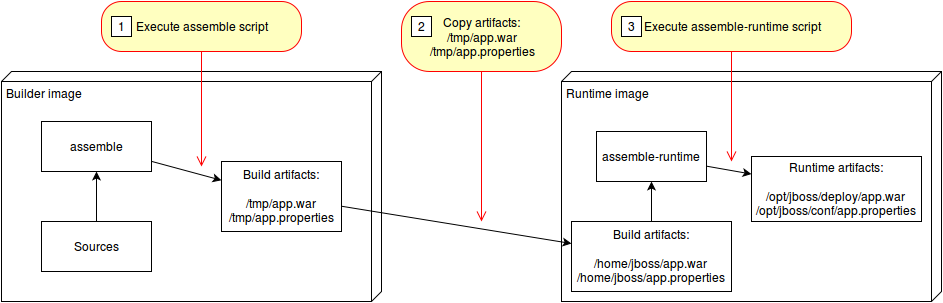
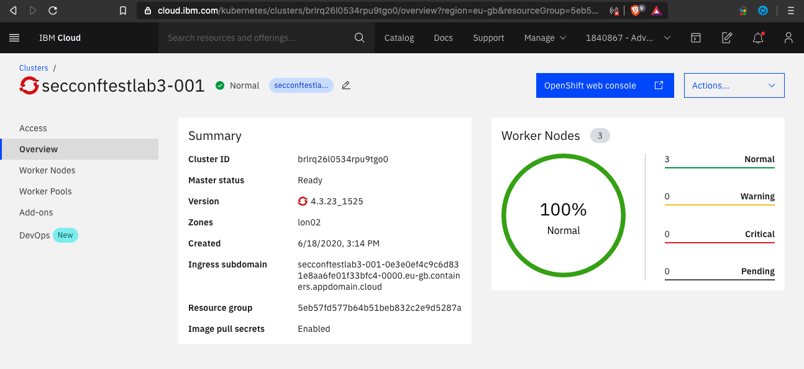
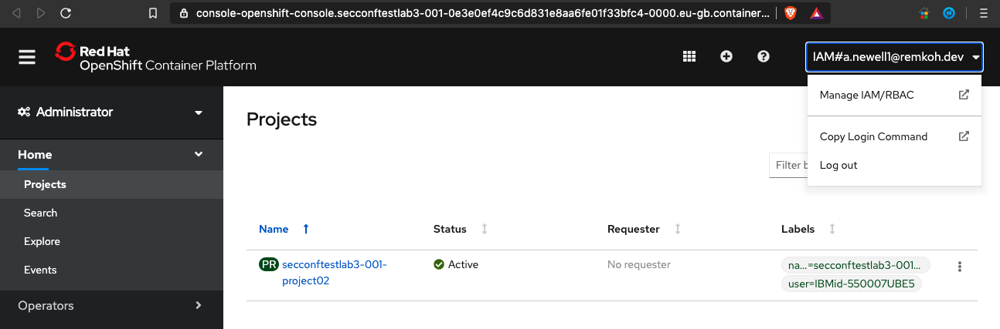

# Lab 03 - Create a Custom Builder Image for Source-to-Image (S2I) 

This project contains a Source-to-Image (S2I) builder image and a S2I runtime image which creates an image running Java web applications on [Open Liberty](https://openliberty.io/).

[Source-to-Image](https://github.com/openshift/source-to-image) (S2I) is an open source toolkit for building reproducible container images from source code. S2I produces ready-to-run images by injecting source code into a container image.

The Open Liberty builder in this lab can be used in two different environments:

* Local Docker runtime via 's2i',
* Deployment to OpenShift'.

With interpreted languages like python and javascript, the runtime container is also the build container. For example, with a node.js application the 'npm install' is run to build the application and then 'npm start' is run in the same container in order to start the application.

However, with compiled languages like Java, the build and runtime processes can be separated. This will allow for slimmer runtime containers for faster application starts and less bloat in the application image.

This lab will focus on the second scenario of using a builder image along with a runtime image.



(source: https://github.com/openshift/source-to-image/blob/master/docs/runtime_image.md)

### Prerequisites

The following prerequisites are needed:

* [A Docker Hub account](https://hub.docker.com)
* [GitHub Account](https://github.com/)
* [IBM Cloud Account](https://cloud.ibm.com/registration)
* [Have followed these steps to get a cluster](https://github.com/IBM/ddc-cloud-native-security-labs/blob/master/workshop/lab-00/README.md)
  * You can stop after step 11

### Setup

For this lab we will need to use a docker-in-docker environment so that we can build our images. For this scenario we will be using the labs client of [IBM Skills Network](https://labs.cognitiveclass.ai/).

1. Follow the instructions [here](skillsNetwork.md) to create your client environment.

1. Clone this repository locally and navigate to the newly cloned directory.

    ```bash
    git clone https://github.com/IBM/s2i-open-liberty-workshop.git -b conference
    cd s2i-open-liberty-workshop
    ```

1. Then we need to install Source to Image. Run the following command to start the installation script.

    ```bash
    chmod +x setup.sh
    ./setup.sh
    ```

1. To make things easier, we are going to set some environment variables that we can reuse in later commands.

    **Note**: Replace *Your Username* with your actual docker hub username. If you do not have one, go [here](https://hub.docker.com) to create one.

    ```bash
    export ROOT_FOLDER=$(pwd)
    export DOCKER_USERNAME=<your-docker-username>
    ```

1. Your root folder should be set to the root of the cloned repository, e.g. `/home/project/s2i-open-liberty-workshop`,

    ```
    echo $ROOT_FOLDER
    /home/project/s2i-open-liberty-workshop
    ```


### Build the builder image

In this section we will create the first of our two S2I images. This image will be responsible for taking in our source code and building the application binary with Maven.

1. Navigate to the builder image directory

    ```bash
    cd ${ROOT_FOLDER}/builder-image
    ```

1. Review the ./Dockerfile

    ```bash
    cat Dockerfile
    ```

    * The image uses a Redhat certified Universal Base Image (UBI) from the public container registry at Redhat,

    ```bash
    FROM registry.access.redhat.com/ubi8/ubi:8.1
    ```

1. You can customize the builder image further, e.g. change the `LABEL` for `maintainer` to your name,

    ```
    LABEL maintainer="<your-name>"
    ```

1. Now build the builder image.

    ```
    docker build -t $DOCKER_USERNAME/s2i-open-liberty-builder:0.1.0 .
    ```

    **Note**: Don't miss the `.` for the current directory at the end of the `docker build` command,

1. Log in to your Dockerhub account. After running the below command, you will be asked to enter your docker password.

    ```bash
    docker login -u $DOCKER_USERNAME
    ```

1. Push the builder image out to Docker hub.

    ```bash
    docker push $DOCKER_USERNAME/s2i-open-liberty-builder:0.1.0
    ```

    With that done, you can now build your runtime image.

### Build the runtime image

In this section you will create the second of our two S2I images. The runtime image will be responsible for taking the compiled binary from the builder image and serving it with the Open Liberty application server.

1. Navigate to the runtime image directory

    ```
    cd $ROOT_FOLDER/runtime-image
    ```

1. Review the ./Dockerfile

    ```
    cat Dockerfile
    ```

1. Build the runtime image

    ```
    docker build -t $DOCKER_USERNAME/s2i-open-liberty:0.1.0 .
    ```

    **Note**: Don't miss the `.` for the current directory at the end of the `docker build` command,

1. Push the runtime image to Docker hub.

    ```bash
    docker push $DOCKER_USERNAME/s2i-open-liberty:0.1.0
    ```

    Now we are ready to build our application with S2I.

### Use S2I to build the application container

In this section, we will use S2I to build our application container image and then we will run the image locally using Docker.

1. Use the builder image and runtime image to build the application image

    ```
    cd $ROOT_FOLDER/web-app
    ```

1. Run a multistage S2I build, to build the application.

    ```
    ~/s2i/s2i build . $DOCKER_USERNAME/s2i-open-liberty-builder:0.1.0 authors --runtime-image $DOCKER_USERNAME/s2i-open-liberty:0.1.0 -a /tmp/src/target -a /tmp/src/server.xml
    ```

    Let's break down the above command:
    - s2i build . - Use [`s2i build`](https://github.com/openshift/source-to-image/blob/master/docs/cli.md#s2i-build) in the current directory to build the Docker image by combining the builder image and sources
    - $DOCKER_USERNAME/s2i-open-liberty-builder:0.1.0 - This is the builder image used to build the application
    - authors - name of our application image
    - --runtime-image $DOCKER_USERNAME/s2i-open-liberty:0.1.0 - Take the output of the builder image and run it in this container.
    - -a /tmp/src/target -a /tmp/src/server.xml - The `runtime-artifact` flag specifies a file or directory to be copies from builder to runtime image. The runtime-artifact is where the builder output is located. These files will be passed into the runtime image.

1. Run the newly built image to start the application on your local machine in the background,

    ```
    docker run -d --rm -p 9080:9080 authors
    ```

1. Check the container is running successfully,

    ```
    docker ps -a
    CONTAINER ID    IMAGE    COMMAND    CREATED    STATUS    PORTS    NAMES
    7ba756f5f45b    authors    "/opt/ol/helpers/run…"    5 seconds ago    Up 4 seconds    0.0.0.0:9080->9080/tcp, 9443/tcp    optimistic_elbakyan
    ```

1. Retrieve the authors using curl,

    ```
    curl -X GET "http://localhost:9080/api/v1/getauthor" -H "accept: application/json"
    ```

### Deployment to OpenShift

In the following steps we will be using two deployment strategies:

* deploy as a traditional Kubernetes `Deployment`, and 
* build and deployment using templates, OpenShift `BuildConfig`, and `DeploymentConfig`.

Now that we have the application running locally and have verified that it works, let's deploy it to an OpenShift environment.

1. Log in with your OpenShift Cluster.

    1. In preparation of this lab, you claimed a cluster that was created for you, and which is now available via your IBM Cloud dashboard,
    1. Browse to your assigned OpenShift cluster Overview page,
    1. From the top right, open your `OpenShift web console` 

        

    1. In the OpenShift Web Console, from the profile dropdown click  `Copy Login Command`.

        

    1. Paste the login command to login, e.g.

    ```bash
    oc login --token=<login-token> --server=https://<cluster-subdomain>:<service-port>
    ```

#### Deploying as a traditional Kubernetes deployment

For this method, we will deploy our application by creating a kubernetes deployment along with a service and a route.

1. Tag the image that was created in the previous section.

    ```bash
    export IMAGE=docker.io/$DOCKER_USERNAME/authors:latest
    echo $IMAGE
    docker tag authors $IMAGE
    ```

2. Push the image that we built locally using s2i to the OpenShift image registry.

    ```bash
    docker push $IMAGE
    ```

3. Go back to the root folder,

    ```bash
    cd $ROOT_FOLDER
    ```

4. Review the `application.yaml` file,

    ```bash
    cat application.yaml
    ```

    This command will add your newly pushed authors image to the deployment yaml file.
  
    ```bash
    sed -i "s|APPLICATION_IMAGE|$IMAGE|" application.yaml
    ```

5. Apply the `application.yaml` file using the `oc` cli to create our Deployment, Service, and Route.

    ```bash
    oc apply -f application.yaml
    ```

6. Now let's visit the deployed application. Run the following to get the route to access the application.

    ```bash
    oc get routes -l app=authors -o go-template='{{range .items}}{{.spec.host}}{{end}}'
    ```

7. Copy and paste the output of the previous command to set a variable $APP_URL,

    ```
    APP_URL=<get-routes-output>
    ```

8. Test the application using curl

    ```
    curl -X GET "http://$APP_URL/api/v1/getauthor" -H "accept: application/json"
    ```

9. Or use the route to your app and paste it into your web browser and add the following to the end of the route:

    ```bash
    /openapi/ui
    ```

    So your route should appear like the following but without the (...):

    ```bash
    authors-route-default...appdomain.cloud/openapi/ui
    ```

    

It sometimes takes a minute to fully deploy so if you get a message about the application not being available, try again.

#### Using Templates, BuildConfigs, and DeploymentConfigs

For this section, you will explore how to build and deploy our application using OpenShift concepts known as templates, build configs and deployment configs. With build configs, the s2i builds are actually happening on the cluster rather than locally.

1. Create a push secret to push the application image to your DockerHub account.

   **You must** modify the following command by replacing **\<Docker Password\>** with your DockerHub password and **\<Docker Email\>** with your email address for DockerHub.

    ```bash
    kubectl create secret docker-registry regcred --docker-server=https://index.docker.io/v1/ --docker-username=$DOCKER_USERNAME --docker-password=<Docker Password> --docker-email=<Docker Email>
    ```

    With the secret created we can now give the *builder* service account access to the secret so that it can push the newly created application image to your account.

    ```bash
    kubectl patch sa builder --type='json' -p='[{"op":"add","path":"/secrets/-","value":{"name":"regcred"}}]'
    ```

1. Then, we need to create a builder template that contains our builder image build config. See [Using Templates](https://docs.openshift.com/container-platform/4.3/openshift_images/using-templates.html).

1. Review the `buildTemplate.yaml` file, which contains the BuildConfig object for the builder image,

    ```bash
    cat buildTemplate.yaml
    ```

1. Next, let's create the build config and start the first build:

    ```bash
    oc process -f buildTemplate.yaml -p DOCKER_USERNAME=$DOCKER_USERNAME | oc apply -f -
    ```

    This command will not only create our build config but also kick off the first build to create our builder image and push it to DockerHub.

    To view the status of the build you can run:

    ```bash
    oc describe build open-liberty-builder
    ```

    Or view the Build section of the OpenShift console.

1. Now let's take a look at our runtime image build config:

    ```bash
    cat runtimeTemplate.yaml
    ```

    Then, create the build config for our runtime image and start the first build:

    ```bash
    oc process -f runtimeTemplate.yaml -p DOCKER_USERNAME=$DOCKER_USERNAME | oc apply -f -
    ```

    To take a look at the build status, run:

    ```bash
    oc describe build open-liberty-app
    ```

    Or view the Build section of the OpenShift console.

Now with our builds run, we can deploy our application. Previously we used a kubernetes deployment object to do this however this time we will use an OpenShift deployment configuration. 

Both objects are similar and will accomplish the same goals however with deployment configs you have greater control of your application's deployment behavior. You also have the option to set automated triggers to kick off builds and deploys based on image, configuration, or git repository changes. Due to a limitation in our workshop environment, we will not be exploring triggers and utilizing image streams with the integrated OpenShift registry, however, if you would like to take a look at a template that automates the entire build and deploy process with triggers, check out the [this example template](./exampleTemplate.yaml) found in the workshop repo.

1. Let's check out the deployment config template:

    ```bash
    cat deploymentConfig.yaml
    ```

1. Then, create the deploymentConfig

    ```bash
    oc apply -f deploymentConfig.yaml
    ```

    ```bash
    oc new-app --template authors-app -p DOCKER_USERNAME=$DOCKER_USERNAME
    ```

1. To verify that your app is deployed, run:

    ```bash
    oc get pods
    ```

    You should see a pod named `authors2-1-` followed by 5 random characters, in the example below they are `x58fk`. This is the application pod.

    ```bash
    oc get pods
    NAME                                  READY   STATUS      RESTARTS   AGE
    authors-deployment-69ff497df6-vz75c   1/1     Running     0          22h
    authors2-1-deploy                     0/1     Completed   0          63s
    authors2-1-x58fk                      1/1     Running     0          60s
    open-liberty-app-1-build              0/1     Completed   0          179m
    open-liberty-builder-1-build          0/1     Completed   0          3h5m
    ```

    You can also view these on the OpenShift dashboard if you navigate to `Workloads` > `Pods` and look for your new pod. Make sure you are in your personal project and not in `default`. The pod name should start with `authors2-`.

1. Once you have verified that the new pod is running, enter the following command to view the application routes.

    ```bash
    oc get routes
    ```

    ```
    oc get routes

    NAME    HOST/PORT    PATH    SERVICES    PORT    TERMINATION    WILDCARD
    authors-route    authors-route-default.your-roks-43-1n-cl-2bef1f4b4097001da9502000c44fc2b2-0000.us-south.containers.appdomain.cloud    authors-service    http    None
    authors2    authors2-default.your-roks-43-1n-cl-2bef1f4b4097001da9502000c44fc2b2-0000.us-south.containers.appdomain.cloud    authors2    9080    None
    ```

1. Copy the route named `authors2` and add it to the end of the command below. 

    ```bash
    export API_URL=
    ```

    View the sample below, however, you will have a different route.

    ```bash
    export API_URL=authors2-default.osgdcw01-0e3e0ef4c9c6d831e8aa6fe01f33bfc4-0000.sjc04.containers.appdomain.cloud
    ```

    Then test your application with the command below:

    ```bash
    curl -X GET "http://$API_URL/api/v1/getauthor" -H "accept: application/json"
    ```

    You should then get a response back from the application that we just deployed:

    ```bash
    curl -X GET "http://$API_URL/api/v1/getauthor" -H "accept: application/json"
    {"name":"Oliver Rodriguez","twitter":"https://twitter.com/heres__ollie","blog":"https://developer.ibm.com"
    ```


### Optional: Customizing your application

In this optional section we will create our own copy of the code push the changes to OpenShift.

1. First we need to create your own version of the code repo by creating a fork. This will copy the repo into your GitHub account. Navigate to the lab repo at https://github.com/IBM/s2i-open-liberty-workshop and click on the **Fork** button in the upper right of the page.

1. When the repo is done forking, click on the green **Clone or download** button and copy your git repo url.

    To make it easier, create an environment variable to hold your repo url. Copy the following command and replace `<repo url>` with your actual repo url:

    ```bash
    export REPOSITORY_URL=<repo url>
    ```

    1. Then, in your terminal, navigate to the `$HOME` directory to clone your repo locally and run the following commands:

    ```bash
    mkdir $HOME/tmp
    cd $HOME/tmp
    git clone $REPOSITORY_URL
    cd s2i-open-liberty-workshop
    ```


2. Now that we have our own copy, let's push a change and test it out. From your browser, navigate to the GitHub repo that you forked. Click on the **Branch** dropdown and select **conference**. 

3. Then navigate to the file at `web-app/src/main/java/com/ibm/authors/GetAuthor.java`

4. Click on the pencil icon in the upper right of the code to enter editing mode.

5. On lines 56-59 edit the name, twitter, and blog to your own information or fake information if you'd like.

    ```java
    Author author = new Author();
        author.name = "Oliver Rodriguez";
        author.twitter = "https://twitter.com/heres__ollie";
        author.blog = "http://developer.ibm.com";
    ```

6. Scroll down and click on `Commit changes`.

7. With the changes pushed, we can now rebuild and redeploy the application. Follow the following steps:

    Build the builder image:

    ``` bash
    oc process -f buildTemplate.yaml -p DOCKER_USERNAME=$DOCKER_USERNAME -p SOURCE_REPOSITORY_URL=$REPOSITORY_URL -p APP_NAME=authors-3 | oc apply -f -
    ```

    ```bash
    oc start-build open-liberty-builder
    ```

    Ensure that the previous build is finished, then start the runtime build:

    ``` bash
    oc start-build open-liberty-app
    ```

    Ensure that the runtime image build is finished, then deploy the app with the following command:

    ```bash
    oc new-app --template authors-app -p DOCKER_USERNAME=$DOCKER_USERNAME -p APP_NAME=authors-3
    ```

8. Once you have verified that the application is deployed and the new pod is running, enter the following command to view the application routes.

    ```
    oc get routes

    NAME    HOST/PORT    PATH    SERVICES    PORT    TERMINATION    WILDCARD
    authors-route    authors-route-default.your-roks-43-1n-cl-2bef1f4b4097001da9502000c44fc2b2-0000.us-south.containers.appdomain.cloud    authors-service    http    None
    authors2    authors2-default.your-roks-43-1n-cl-2bef1f4b4097001da9502000c44fc2b2-0000.us-south.containers.appdomain.cloud    authors2    9080    None
    ```

9. Copy the route named `authors-3` and add it to the end of the command below.

    ```bash
    export API_URL=
    ```

    View the sample below, however, you will have a different route.

    ```bash
    export API_URL=authors2-default.osgdcw01-0e3e0ef4c9c6d831e8aa6fe01f33bfc4-0000.sjc04.containers.appdomain.cloud
    ```

    Then test your application with the command below:

    ```bash
    curl -X GET "http://$API_URL/api/v1/getauthor" -H "accept: application/json"
    ```

You should then see the info that you edited in the file earlier.

## Conclusion
In this lab we have explored building our own custom s2i images for building containerized application from source code. We utilized a multi stage s2i process that separated the build environment from the runtime environment which allowed for us to have a slimmer application image. Then, we deployed the application as a traditional Kubernetes deployment. Lastly, we explored how to build and deploy the application using templates, OpenShift build configs, and deployment configs.


1. Go back to the [Summary](../SUMMARY.md).