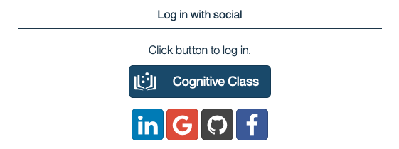

# IBM Skills Network Access

## Create an account

1. Navigate to https://labs.cognitiveclass.ai/register,

    

1. Create a new account with a Social login (LinkedIn, Google, Github or Facebook), or click the `Cognitive Class` button,

    

1. Click `Create an Account`,

2. Fill in your Email, Full Name, Public Username and password, click on the check boxes next to the `Privacy Notice` and `Terms of Service` to accept them. Then click on `Create Account`.

3. You will then be taken to a page with a list of sandbox environments. Click on the option for **Theia - Cloud IDE (With OpenShift)**

    

4. Wait a few minutes while your environment is created.

    

5. You will be taken to a blank editor page once your environment is ready.

6.  What we really need is access to the terminal. Click on the Terminal tab near the top of the page and select **New Terminal**

    

7.  You can then click and drag the top of the terminal section upwards to make the terminal section bigger.

    

With that done, you can return back to the lab.

<- [Back to the lab](./README.md)